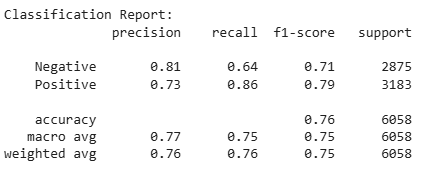

---

### 3kinds of average

* **Macro avg** → simple average of metrics across classes (treats classes equally).
* **Weighted avg** → weighted by support (class size).
* **Accuracy** → overall correct predictions.

### Accuracy
👉 **Accuracy = 0.76 (76%)**

### Average of all metrics
**average of all metrics (precision, recall, f1)** across both classes, then you can take the **macro average** row:

👉 **Precision = 0.77, Recall = 0.75, F1 = 0.75**

$$
\frac{0.77 + 0.75 + 0.75}{3} \approx 0.76
$$

✅ **Final Single Score to report: \~0.76 (76%)**
