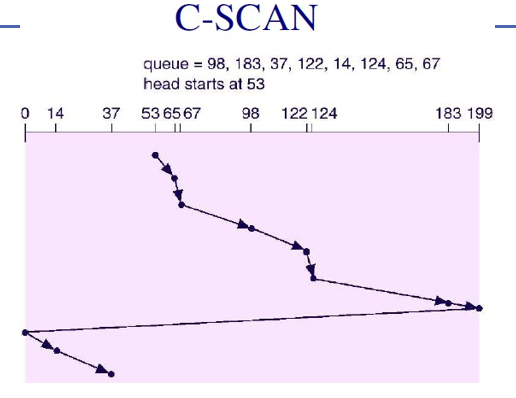

- C-SCAN (Circular SCAN) Disk Scheduling Algorithm

### ✅ How It Works:
- The disk arm **moves in only one direction** (e.g., from innermost to outermost cylinder).
    
- It **services all requests** in that direction.
    
- Once it reaches the end, it **jumps back to the beginning** **without servicing any requests on the return**.
    
- This provides **more uniform wait times** compared to SCAN.

### 🧠 **Key Points:**

- Acts like SCAN, but the **head doesn't reverse**.
    
- Instead, it **wraps around** to the start, similar to how a **circular queue** works.
    
- Think of it as an **elevator that only goes up**, and once it reaches the top, it comes down empty and starts going up again.
    

---

### 📈 **Advantages:**

- ✅ **More uniform wait time**: New requests get fairer treatment regardless of location.
    
- ✅ **Avoids unfairness** to requests just behind the head.
    
- ✅ **Predictable performance**, especially in heavy load systems.
    

---

### ❌ **Disadvantages:**

- ❌ **Long jump time** when head moves from end to start.
    
- ❌ Slightly **more overhead** due to wrap-around.