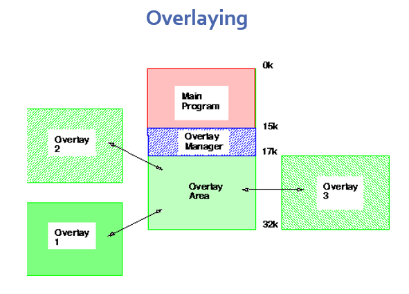

#first-semester #advanced-operating-system
Only **load into memory** the **parts of a program (instructions/data)** that are **needed at the moment**.

### Figure

### 🔄 **Why it's used:**

- When a program is **too large** to fit entirely into memory.
    
- Helps run **large programs on systems with small memory**.

### 🛠️ **How it's done:**

- The **programmer manually breaks** the program into **modules**.
    
- Only **one module (or overlay)** is loaded at a time, replacing the old one.
    
- No operating system help is needed — the programmer handles the logic.
    

---

### ⚠️ **Limitations:**

- **No automatic support** from the OS.
    
- Programmer must **design the overlay structure** carefully — this is **complex** and error-prone.