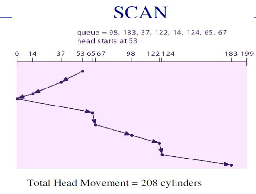

- Elevator Algorithm
	
- The disk arm **moves in one direction** (like an elevator) servicing all requests **until it reaches the end** AKA *literally touches 0 and goes towards 199 as in fig*.
    
- Then, it **reverses direction** and services the remaining requests on the way back.
    
- Just like an elevator: it goes all the way up, then all the way down — serving requests in both directions.

### 🧠 Key Points:

- SCAN sorts all pending disk requests by their **cylinder number**.
    
- It **minimizes seek time** compared to FCFS and SSTF.
    
- Also called **"elevator algorithm"** due to its motion pattern.
    

---

### 📈 Advantages:

- ✅ **Reduces starvation**: Unlike SSTF, it doesn't skip far requests forever.
    
- ✅ **Fair and predictable**: Each request will be served in a bounded time.
    
- ✅ **Better performance** than FCFS and avoids starvation problem of SSTF.
    

---

### ❌ Disadvantages:

- ❌ **Long waiting time** for requests just behind the head (since the head continues to the end before reversing).
    
- ❌ **Not the most efficient** for all access patterns (e.g., uniformly distributed requests).

