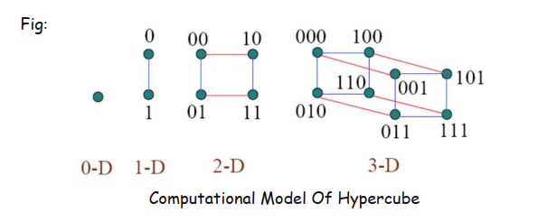

## 🔷 What is a Hypercube?

A **hypercube** is a special way of **connecting computers (processors)** so they can communicate **quickly and efficiently** in parallel computing.

Think of it as a network where each computer (node) is connected based on a rule using **binary numbers**.

---

### 📌 Why is it called a “hypercube”?

Because it generalizes:

* A **line (1D cube)** → 2 nodes
* A **square (2D cube)** → 4 nodes
* A **cube (3D)** → 8 nodes
* And so on… into higher dimensions.

Just like how a 3D cube has 8 corners, a 4D hypercube has 16, a 5D has 32, and so on.

---

## 🔹 Key Features Explained Simply:

### 1. **Dimension (d)**

* The **dimension d** tells how many **bits** we use to label processors.
* Also tells **how many neighbors** each processor is connected to.

✅ For example:
If **d = 3**, then each processor has a **3-bit address** → e.g., `000`, `101`, `111`
And each processor is connected to **3 other processors** (only 1-bit difference).

---

### 2. **Number of Processors**

* Formula: **2^d**
  → So, a 3D hypercube has **8 processors**, 4D has **16**, 5D has **32**, etc.

---

### 3. **Processor Labels (Coding)**

* Each processor is labeled using a **binary number** of d digits.
* Example (d = 3):
  `000`, `001`, `010`, `011`, `100`, `101`, `110`, `111`

---

### 4. **Hamming Distance**

* The **Hamming Distance** between two processors is the number of bits that are different in their labels.
* In a hypercube, **connected processors have Hamming Distance = 1**

✅ Example:
`000` is connected to `001`, `010`, and `100` — all differ by only 1 bit.

---

### 5. **Diameter**

* This is the **longest shortest path** between any two processors.
* In hypercube: **Diameter = d**
  → So in Q₄ (4D), it takes at most 4 hops to go from any node to any other.

---

### 6. **Bisection Width**

* The minimum number of connections (edges) you must cut to divide the network in two **equal parts**.
* Formula: **2^(d - 1)**
  → More bisection width = better communication performance.

---

## 📌 Easy Real-Life Analogy

> Think of hypercube like a **Rubik’s Cube of communication**:
> Each square (processor) is connected with nearby squares based on a neat pattern — but in many dimensions!

It’s like a **super-efficient WhatsApp group** where each person is only allowed to talk to a few others — but messages still spread fast!

---

## 🔹 Properties Summary Table:

| Property             | Formula / Value       | Meaning                             |
| -------------------- | --------------------- | ----------------------------------- |
| Dimension (d)        | Given                 | Number of bits, levels, directions  |
| Nodes / Processors   | 2^d                   | Total number of processors          |
| Connections per node | d                     | Each processor connects to d others |
| Hamming Distance     | 1 (between neighbors) | Only 1 bit differs                  |
| Diameter             | d                     | Max steps to reach any node         |
| Bisection Width      | 2^(d - 1)             | Connections to cut network in half  |

---

## 🔸 Scalability

* A **Qd+1 hypercube** can be built by connecting **two Qd hypercubes**
* So, it is very scalable (easy to expand for big systems)

---

## 🔸 Variants of Hypercube

Other networks **based on or inspired by hypercube** include:

* **Butterfly network**
* **Shuffle-exchange**
* **Cube-connected cycles**

These are often used in sorting, routing, or other parallel algorithms.

---

## ✅ Final Exam Summary (Write like this)

> A **d-dimensional hypercube (Qd)** has 2ᵈ processors labeled with d-bit binary numbers. Each processor connects to d others, differing by 1 bit (Hamming distance 1). The diameter is d, and bisection width is 2d−1. It’s scalable, fault-tolerant, and widely used in parallel computing. It also forms the basis of networks like butterfly and shuffle-exchange.

---

Would you like me to create a diagram for a **3D hypercube** or show a **broadcasting example** on it?
