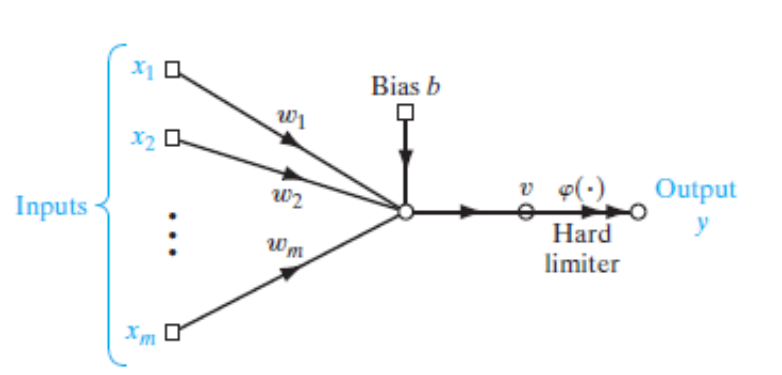
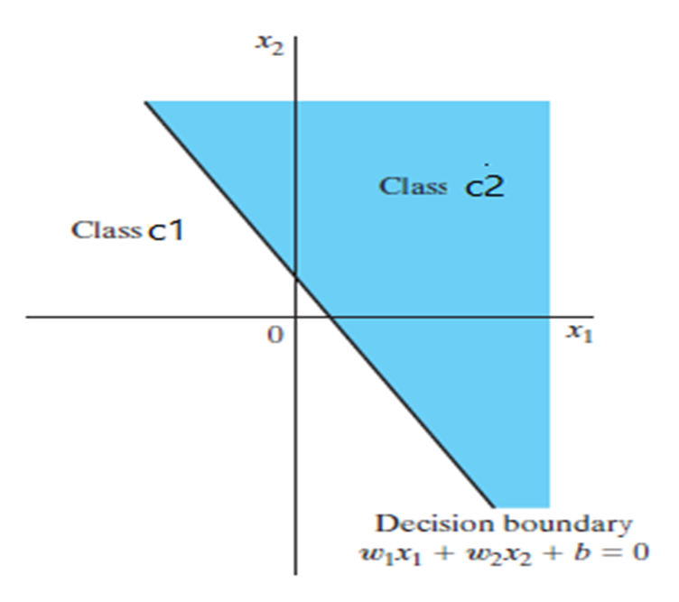

- A **perceptron** is the **simplest type of neural network model**, introduced by **Frank Rosenblatt** in 1958. 

- It is used for **binary classification** — deciding whether an input belongs to one class or another.

- It has single neuron with adjustable weights and biases.

---
### 🧠 What It Does:
This perceptron is acting like a **line** (or hyperplane in higher dimensions) dividing space:

- If input falls on one side → output = 1
    
- Other side → output = 0
---
### ⚠️ Limitation:
A perceptron can only classify  [linearly separable data](linearly%20separable.md) — it **cannot** solve problems like XOR unless you stack multiple perceptrons (like in MLPs — Multi-Layer Perceptrons).

---

### Simple Description

|Feature|Description|
|---|---|
|Type|Binary classifier|
|Inputs|Numeric values (features)|
|Output|0 or 1|
|Use|Simple classification problems|
|Limitation|Only works for linearly separable data|

---

### 📌 **Summary of Perceptron Concepts:**

1. **Perceptron Convergence**:
    
    - Rosenblatt proved that the perceptron algorithm **converges** if the training data are from **two linearly separable classes**.
        
    - The decision boundary formed is a **hyperplane** that separates the two classes.
        
2. **Limitation to Two-Class Classification**:
    
    - A **single-neuron** perceptron can only classify **two classes**.
        
3. **Multi-Class Classification**:
    
    - To classify *more than two classes*, the output layer must have *multiple neurons*.
        
    - However, the classes must still be linearly separable* for correct operation.
        
4. **Neural Model Basis**:
    
    - Rosenblatt’s perceptron is based on the *McCulloch–Pitts model* of a neuron.
        
5. **Function of the Neuron**:
    
    - The neuron computes a **linear combination** of its inputs.
        
    - This sum is passed through a **hard limit (threshold) activation function**.
        
6. **Output Behavior**:
    
    - If the summed input is **positive**, the neuron outputs **+1**.
        
    - If the summed input is **negative**, the neuron outputs **-1**.
        

---

### Perceptron Figure

#### Hard Limiter function
$$
v = \sum_{i=1}^{m} w_i x_i + b
$$

#### Description 

1. **Goal**:
    
    - To classify input vectors $x_1,x_2,...,x_m$ into one of **two classes**: $c_1 \text{ or } c_2$.
        
2. **Decision Rule**:
    
    - If perceptron output $y=+1$, assign the input to class $c_1$.
        
    - If $y=−1$, assign it to class $c_2$.
        
3. **Decision Boundary**:
    
    - The input space is divided into **two regions**.
        
    - These regions are separated by a **hyperplane**, which defines the decision surface of the perceptron.

---
#### Hyperplane

---
### Perceptron can show behavior of AND function and OR function but not XOR funciton
- Because XOR is not linearly separable
###### Figure AND, OR , XOR

