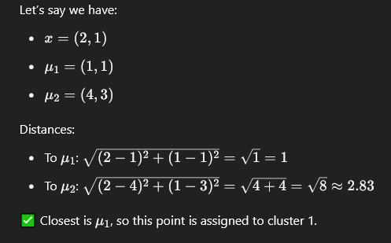

## 💡 Let’s understand the parts:

- x: The data point (or sample) you're currently looking at.
    
- μk​: The center of the $k^{th}$ cluster.
    
- ||x−μk​|| : This is the **Euclidean distance** (how far apart they are in space).
    
- $min_k$​: We want the **minimum** distance over all clusters.
    
- $\text{arg } min_k$​​: We’re asking: **Which cluster k gives the smallest distance?**
    

### ✅ In simple terms:

> Compare your sample x to **each cluster center**, calculate how far it is from each one, and **choose the closest**.

#### Example
