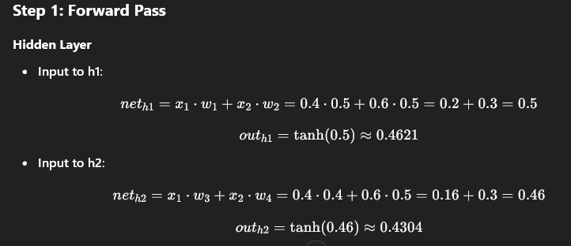
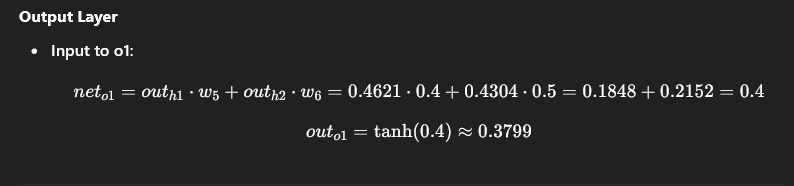
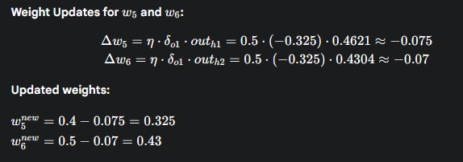
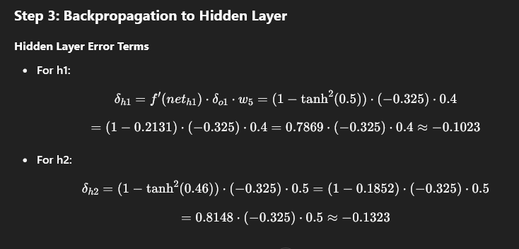

Consider a MLP given below. Let the learning rate be 0.5. The initial weights of the network are given in the figure. Assume that first training tuple is (0.4, 0.6) and its target output is 0. Calculate weight updates by using back-propagation algorithm. Assume tanh activation function.

### Solution:

