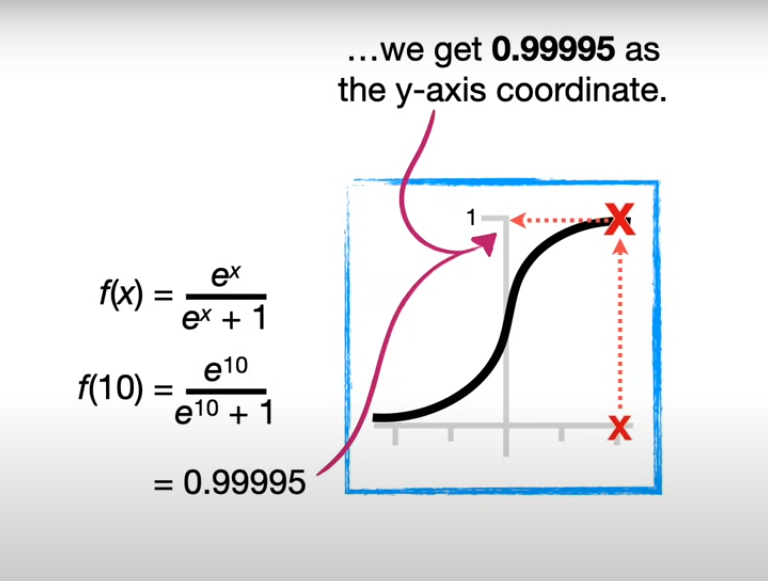

### Sigmoid Activation Function
- In general Sigmoid takes `x-cor` input and gives `y-cor` in output in range `0-1`
#### Example

---
### Tanh Activation Function
- Also know as hyperbolic tangent
- Takes `x-cor` and changes it to `y-cor` in range `[1,-1]`

