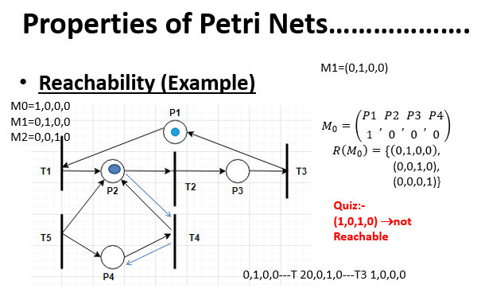

## 🧠 **Reachability in Petri Nets – Quick Summary**

### ✅ **Definition:**

Reachability checks whether a **marking $M$** can be obtained from an **initial marking $M_0$** by firing a sequence of transitions.

* **Notation:**
  $M_0 \xrightarrow{T_1, T_2, \dots, T_k} M$ or simply $M_0 [\sigma⟩ M$, where $\sigma$ is a sequence of transitions.

---

### 🔢 **Example Walkthrough:**

* **Markings:**

  * $M_0 = (1, 0, 0, 0)$: 1 token in P1
  * $M_1 = (0, 1, 0, 0)$: after firing a transition from P1 → P2
  * $M_2 = (0, 0, 1, 0)$: then P2 → P3
  * $M_3 = (0, 0, 0, 1)$: then P3 → P4
  * Then P4 → back to P1 (loop)

* **Reachable Set:**
  $R(M_0) = \{(1,0,0,0), (0,1,0,0), (0,0,1,0), (0,0,0,1)\}$

---

### 🚫 **Why (1,0,1,0) is *Not Reachable*:**

* The system behaves like a **single-token cyclic process**.
* One token travels through P1 → P2 → P3 → P4 → P1...
* There is **never more than one token**, so **no marking can have tokens in multiple places simultaneously.**
* Hence, markings like $(1,0,1,0)$ are **not reachable** because there's **no way for the token to split**.

---

## ⚙️ **Why Reachability Matters:**

* ✅ **Deadlock Detection**: Can we reach a state where no transition is enabled?
* ✅ **Safety Verification**: Can we reach a "bad" state (e.g., two tokens in critical section)?
* ✅ **Liveness Checking**: Will the system always eventually reach a desired state?
* ✅ **Correctness Proof**: Verifies the system follows desired behavior paths.

---

## ✍️ **How to Write in Exam (5 Marks Style):**

**Reachability** in a Petri Net is the property of determining whether a particular marking (distribution of tokens) can be reached from the initial marking by firing a sequence of transitions.
Formally, a marking $M$ is reachable from $M_0$ if there exists a transition sequence $\sigma$ such that $M_0 [\sigma⟩ M$.

This property is used to analyze system behavior, detect deadlocks, verify safety, and ensure liveness.
In single-token cyclic systems, markings with multiple tokens (e.g., $(1,0,1,0)$) are not reachable since the token cannot split.

---

