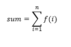

The above is data flow for the summation


---

## 🧠 Traditional `for` Loop Recap:

```c
sum = 0;
for (i = 1; i <= n; i++) {
    sum = sum + f(i);
}
return sum;
```

* In imperative style, this is executed step-by-step.
* In dataflow, we **model it as a graph of operations** connected by **data dependencies**.

---

## 🔄 Dataflow Components Used

| Component         | Purpose                                                 |
| ----------------- | ------------------------------------------------------- |
| **Merge**         | Chooses between **initial input** or **feedback value** |
| **Switch**        | Routes data **based on predicate (condition)**          |
| **Predicate**     | Evaluates loop condition (`i ≤ n`)                      |
| **Function**      | Represents `f(i)`                                       |
| **Increment**     | Performs `i = i + 1`                                    |
| **Add**           | Performs `sum = sum + f(i)`                             |
| **Feedback Arcs** | Loop the new values back to the **Merge** nodes         |

---

## 🔁 Loop Execution Flow Summary

| Step | Description                                           |
| ---- | ----------------------------------------------------- |
| 1️⃣  | Initialize `i = 1`, `sum = 0` — pass to Merge actors  |
| 2️⃣  | Evaluate condition: `i ≤ n`                           |
| 3️⃣  | If **TRUE**, Switch routes values down the loop path  |
| 4️⃣  | Calculate `f(i)`, do `sum + f(i)`, and `i + 1`        |
| 5️⃣  | Feed `i+1` and updated `sum` back into Merge          |
| 6️⃣  | Repeat until predicate is FALSE                       |
| 7️⃣  | When FALSE, Switch routes **final sum** to **output** |

---

## 🔗 Why This Is Powerful in Dataflow:

* There is **no global clock** or loop index manager.
* Everything is **triggered by availability of data (tokens)**.
* Parallelism is naturally possible:

  * If multiple iterations can run independently (e.g., in **map-reduce style**), they can **fire in parallel**.
* This is **self-regulating** and doesn't need explicit looping control.

---

## 🧩 Visual Analogy:

Here's a very simplified text diagram to help you visualize:

```
          ┌────────────┐
     ┌───▶│   Merge    │◀───┐
     │    └────┬───────┘    │
     │         ▼            │
Initial i,0    │         (from last iteration)
     │      ┌───────┐
     │      │Compare│◀───── n
     │      └──┬────┘
     │         ▼
     │      ┌──────┐  FALSE ──▶ Output (final sum)
     └─────▶│Switch ├───┐
            └──────┘   │
                       ▼ TRUE
                  ┌────────────┐
                  │ f(i), i+1  │
                  └────┬───────┘
                       ▼
                   ┌──────┐
                   │ sum+ │
                   └──┬───┘
                      ▼
                    back to Merge
```

---

## ✅ Final Notes for Exams:

* This models loops **without iteration counters or branches**
* Loops are built from **Merge-Switch-Predicate-Feedback** patterns
* **Key idea**: execute **as soon as all inputs are ready**
* Enables **parallelism and concurrency**
* **Flexible for pipelining and stream processing**

---

