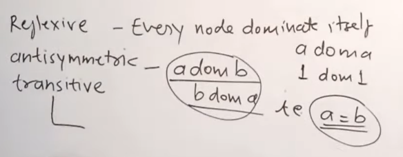

### Properties of Dominators

## Reference
- [YouTube- Dominator Tree](https://www.youtube.com/watch?v=tiyeuHsBO2U)

1. Reflexive -> Every node dominates itself
2. Antisymmetric -> If `a dom b` and `b dom a` then `a=b`
3. Transitive -> ` a dom b` and `b dom c` THEN ` a dom c`

To Remember -> **RAT** 

---
# 1️⃣ Dominators — build the intuition first

## Control Flow Graph (CFG)

A **CFG** is a directed graph where:

* nodes = basic blocks
* edges = possible flow of control
* there is a **single entry (start) node**

---

## What does “dominate” mean?

> A node **d** dominates a node **n**
> **if every path from the entry node to n passes through d**

### Think in real life

* Entry node = **main gate**
* Node `n` = **room**
* Node `d` = **corridor**

If **every possible way** to reach the room must pass through that corridor, then the corridor **dominates** the room.

---

## Formal definition

Let `G` be a flow graph with entry node `s`.

A node `d` **dominates** node `n` iff:

> Every path from `s` to `n` contains `d`

Notation:

* `d dom n`
* or `d ∈ Dom(n)`

---

## Properties (very important)

1. **Every node dominates itself**

   * Trivial: every path to `n` passes through `n`

2. **The entry node dominates all nodes**

   * All paths start at the entry

---

# 2️⃣ Dominator Set (Dom(n))

For each node `n`:

> `Dom(n)` = set of all nodes that dominate `n`

Example idea:

* If `Dom(n) = {A, B, C}`
* then **A, B, C must appear on every path** to `n`

---

# 3️⃣ Why dominators matter (context)

Dominators are used to:

* detect **control dependence**
* place **ϕ (phi) functions** in SSA
* build **dominator trees**
* identify **natural loops**

👉 **Immediate dominator** comes from organizing dominators into a tree.

---
