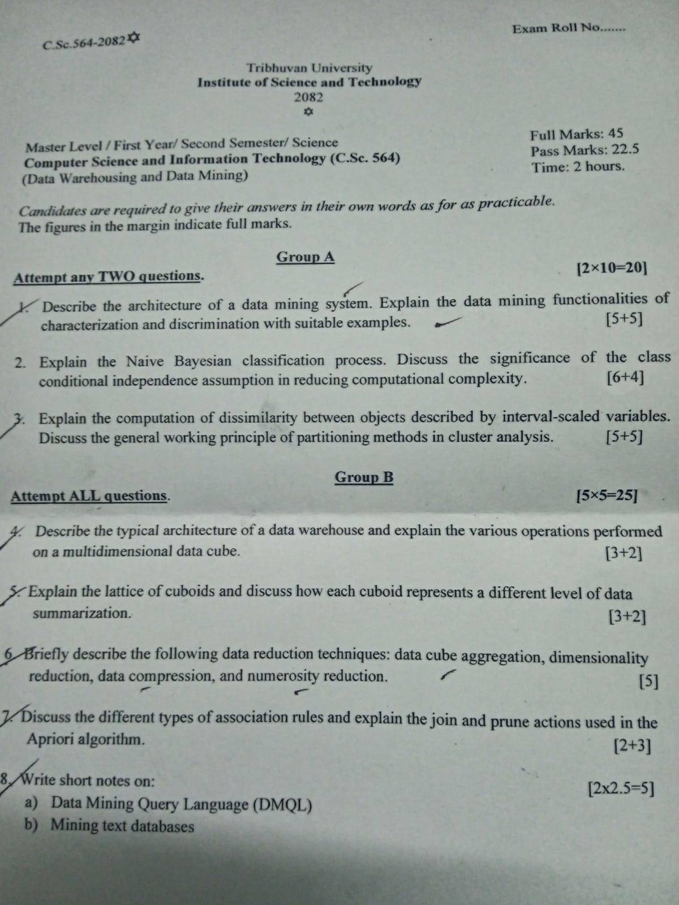

### Board

- Qno 2 Explain the process of Naive Bayesian Classification. What is the significance of the class conditional independence in the Naive Bayesian Classification?
	- [DWDM board qno2 - Class Conditional Independence in Naive Bayes](../que-ans/DWDM%20board%20qno2%20-%20Class%20Conditional%20Independence%20in%20Naive%20Bayes.md)
- Qno 3 about Dissimilarity and Partitioning Method
	- [DWDM Board qno3 dissimilarity in interval scaled and partitioning method](../que-ans/DWDM%20Board%20qno3%20dissimilarity%20in%20interval%20scaled%20and%20partitioning%20method.md)

---
### Preboard

- Logical arch -? Bottom Mid Top tier
- Q1. Discuss the various techniques used to handle noisy data during the data cleaning process. Explain the binning method for data smoothing with a suitable example. 
	- [Techniques to handle noise data during data cleaning](../que-ans/Techniques%20to%20handle%20noise%20data%20during%20data%20cleaning.md)

---
### Mid term

- What are data mining primitives, and how do they assist in specifying or defining data mining tasks? Explain the role of concept hierarchies in data mining with a suitable example. [3+2]