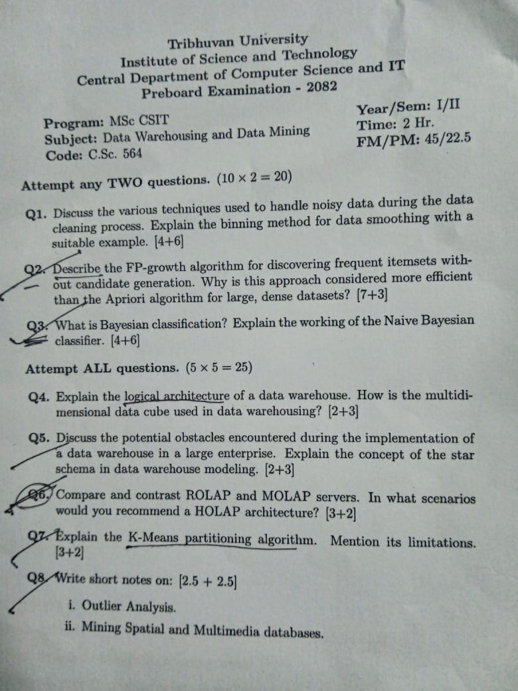
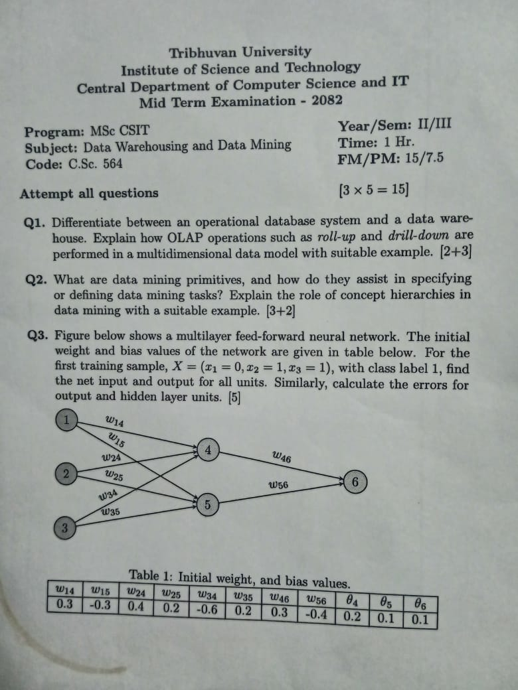

### Board
!

---
### Preboard

- Logical arch -? Bottom Mid Top tier
- Q1. Discuss the various techniques used to handle noisy data during the data cleaning process. Explain the binning method for data smoothing with a suitable example. 
	- [Techniques to handle noise data during data cleaning](../que-ans/Techniques%20to%20handle%20noise%20data%20during%20data%20cleaning.md)

---
### Mid term

- What are data mining primitives, and how do they assist in specifying or defining data mining tasks? Explain the role of concept hierarchies in data mining with a suitable example. [3+2]