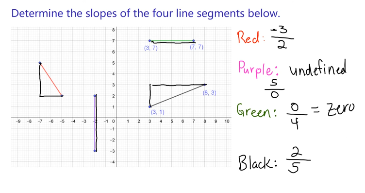
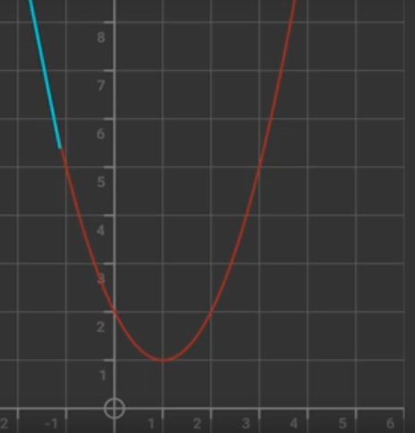

- Positive - Up to right
- Negative - Down to Left
- Zero - NO rise or fall
- Undefined - Vertical line

- Rise (Up or Down - Y direction) then Run(X-direction)
- change in respect to `y` with `x`
$(y_2 - y_1) \div (x_2-x_1)$

### Curve
- Draw a tangent(*line that just touches the curve*) to the point in the curve
- Slope is also a derivative w.r.t `x` in the formula

 

 