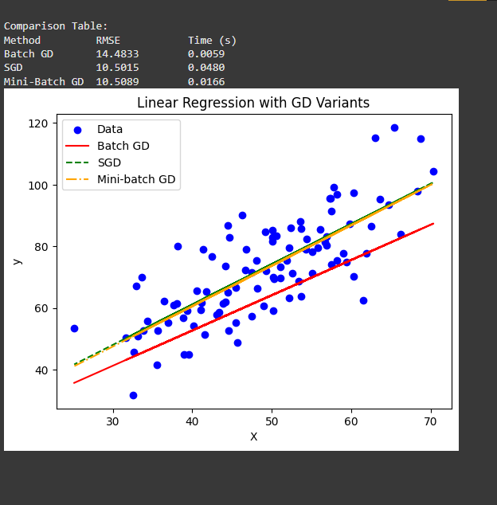

```python
import numpy as np
import pandas as pd

data = pd.read_csv(data_path, header=None)

# Manually setting two columns
data.columns = ['x', 'y']
print(data)

X = data['x'].values
y = data['y'].values
n = len(y)


import matplotlib.pyplot as plt
import time

# Normalize X for stability
X_norm = (X - np.mean(X)) / np.std(X)
X_b = np.c_[np.ones((n, 1)), X_norm]  # Add bias term

# Learning Rate
alpha = 0.001

# RMSE function
def rmse(y_true, y_pred):
    return np.sqrt(np.mean((y_true - y_pred) ** 2))

# Batch Gradient Descent
def batch_gd(X, y, lr=0.01, epochs=1000):
    m = np.zeros(X.shape[1])
    start = time.time()
    for _ in range(epochs):
        gradients = -(2/n) * X.T.dot(y - X.dot(m))
        m -= lr * gradients
    end = time.time()
    y_pred = X.dot(m)
    return m, rmse(y, y_pred), end - start

# Stochastic Gradient Descent
def stochastic_gd(X, y, lr=0.01, epochs=50):
    m = np.zeros(X.shape[1])
    start = time.time()
    for _ in range(epochs):
        for i in range(n):
            idx = np.random.randint(n)
            xi = X[idx:idx+1]
            yi = y[idx]
            gradients = -2 * xi.T.dot(yi - xi.dot(m))
            m -= lr * gradients
    end = time.time()
    y_pred = X.dot(m)
    return m, rmse(y, y_pred), end - start

# Mini-Batch Gradient Descent
def mini_batch_gd(X, y, batch_size=8, lr=0.01, epochs=200):
    m = np.zeros(X.shape[1])
    start = time.time()
    for _ in range(epochs):
        indices = np.random.permutation(n)
        X_shuffled = X[indices]
        y_shuffled = y[indices]
        for i in range(0, n, batch_size):
            xi = X_shuffled[i:i+batch_size]
            yi = y_shuffled[i:i+batch_size]
            gradients = -(2/len(xi)) * xi.T.dot(yi - xi.dot(m))
            m -= lr * gradients
    end = time.time()
    y_pred = X.dot(m)
    return m, rmse(y, y_pred), end - start

# Train models
m_bgd, rmse_bgd, time_bgd = batch_gd(X_b, y, lr=alpha, epochs=1000)
m_sgd, rmse_sgd, time_sgd = stochastic_gd(X_b, y, lr=alpha, epochs=50)
m_mbgd, rmse_mbgd, time_mbgd = mini_batch_gd(X_b, y, batch_size=8, lr=alpha, epochs=200)

# Show results
print("\nComparison Table:")
print(f"{'Method':<15}{'RMSE':<15}{'Time (s)':<15}")
print(f"{'Batch GD':<15}{rmse_bgd:<15.4f}{time_bgd:<15.4f}")
print(f"{'SGD':<15}{rmse_sgd:<15.4f}{time_sgd:<15.4f}")
print(f"{'Mini-Batch GD':<15}{rmse_mbgd:<15.4f}{time_mbgd:<15.4f}")

# Plot fitted lines
plt.scatter(X, y, color='blue', label='Data')
plt.plot(X, m_bgd[0] + m_bgd[1] * X_norm, color='red', label='Batch GD')
plt.plot(X, m_sgd[0] + m_sgd[1] * X_norm, color='green', linestyle='--', label='SGD')
plt.plot(X, m_mbgd[0] + m_mbgd[1] * X_norm, color='orange', linestyle='-.', label='Mini-batch GD')
plt.xlabel('X')
plt.ylabel('y')
plt.title('Linear Regression with GD Variants')
plt.legend()
plt.show()

```

---
### Mathematical Breakdown of the Code

---

### 1. **Normalization of X**

```python
X_norm = (X - np.mean(X)) / np.std(X)
```

Mathematically, for each feature $x_i$:

$$
x_i^{\text{norm}} = \frac{x_i - \mu_X}{\sigma_X}
$$

Where:

* $\mu_X = \frac{1}{n}\sum_{i=1}^{n} x_i$ (mean of X)
* $\sigma_X = \sqrt{\frac{1}{n}\sum_{i=1}^{n} (x_i - \mu_X)^2}$ (standard deviation of X)

**Purpose:** Normalization helps gradient descent converge faster because all features are on the same scale.

---

### 2. **Adding the Bias Term**

```python
X_b = np.c_[np.ones((n, 1)), X_norm]
```

We represent linear regression as:

$$
\hat{y} = m_0 + m_1 x
$$

Adding the bias term as a column of ones lets us write it in **matrix form**:

$$
\hat{y} = X_b \cdot \mathbf{m} \quad \text{where } \mathbf{m} = 
\begin{bmatrix} m_0 \\ m_1 \end{bmatrix}
$$

---

### 3. **Linear Regression Prediction**

$$
\hat{y} = X_b \mathbf{m}
$$

Where $X_b \in \mathbb{R}^{n \times 2}$ and $\mathbf{m} \in \mathbb{R}^{2 \times 1}$.

* $n$ is the number of samples.
* $\hat{y}$ is the predicted output vector.

---

### 4. **Loss Function (MSE / RMSE)**

```python
def rmse(y_true, y_pred):
    return np.sqrt(np.mean((y_true - y_pred) ** 2))
```

Mathematically, **RMSE** is:

$$
\text{RMSE} = \sqrt{\frac{1}{n} \sum_{i=1}^n (y_i - \hat{y}_i)^2}
$$

* $y_i$ is the true value.
* $\hat{y}_i$ is the predicted value.

---

### 5. **Batch Gradient Descent (BGD)**

```python
gradients = -(2/n) * X.T.dot(y - X.dot(m))
m -= lr * gradients
```

**Mathematically:**
The cost function (MSE) is:

$$
J(\mathbf{m}) = \frac{1}{n} \sum_{i=1}^{n} (y_i - \hat{y}_i)^2 = \frac{1}{n} \| \mathbf{y} - X_b \mathbf{m} \|^2
$$

The gradient of $J$ w\.r.t $\mathbf{m}$ is:

$$
\nabla_{\mathbf{m}} J = -\frac{2}{n} X_b^T (\mathbf{y} - X_b \mathbf{m})
$$

The weight update rule is:

$$
\mathbf{m} := \mathbf{m} - \alpha \nabla_{\mathbf{m}} J
$$

* This is **Batch GD** because the gradient is computed using all $n$ data points.

---

### 6. **Stochastic Gradient Descent (SGD)**

```python
gradients = -2 * xi.T.dot(yi - xi.dot(m))
m -= lr * gradients
```

**Mathematically:**
For **one sample** $(x^{(i)}, y^{(i)})$, the gradient is:

$$
\nabla_{\mathbf{m}} J_i = -2 x^{(i)T} (y^{(i)} - x^{(i)T} \mathbf{m})
$$

Weight update:

$$
\mathbf{m} := \mathbf{m} - \alpha \nabla_{\mathbf{m}} J_i
$$

* This introduces **noise** but allows faster updates.
* Each iteration updates weights using **one random sample**.

---

### 7. **Mini-Batch Gradient Descent (MBGD)**

```python
gradients = -(2/len(xi)) * xi.T.dot(yi - xi.dot(m))
m -= lr * gradients
```

**Mathematically:**
For a mini-batch of size $b$, the gradient is:

$$
\nabla_{\mathbf{m}} J_{\text{batch}} = -\frac{2}{b} X_{\text{batch}}^T (\mathbf{y}_{\text{batch}} - X_{\text{batch}} \mathbf{m})
$$

Update rule:

$$
\mathbf{m} := \mathbf{m} - \alpha \nabla_{\mathbf{m}} J_{\text{batch}}
$$

* This is **a compromise** between BGD (stable but slow) and SGD (fast but noisy).

---

### 8. **Training the models**

```python
m_bgd, rmse_bgd, time_bgd = batch_gd(...)
```

* Solves $\mathbf{m}$ using gradient descent.
* Calculates RMSE:

$$
\text{RMSE} = \sqrt{\frac{1}{n} \sum_{i=1}^n (y_i - \hat{y}_i)^2}
$$

* Measures computation time for each algorithm.

---

### 9. **Plotting**

```python
plt.plot(X, m_bgd[0] + m_bgd[1] * X_norm, ...)
```

* Regression line formula:

$$
\hat{y} = m_0 + m_1 x^{\text{norm}}
$$

* `m0` is the **intercept**, `m1` is the **slope** learned via gradient descent.
* Plots **predicted lines** along with actual data points.

---

✅ **Summary of Mathematical Concepts:**

| Concept              | Formula                                                     |
| -------------------- | ----------------------------------------------------------- |
| Prediction           | $\hat{y} = m_0 + m_1 x$                                     |
| MSE                  | $J(m) = \frac{1}{n}\sum (y_i - \hat{y}_i)^2$                |
| RMSE                 | $\text{RMSE} = \sqrt{\frac{1}{n} \sum (y_i - \hat{y}_i)^2}$ |
| Batch GD update      | $m := m - \alpha \cdot (-\frac{2}{n} X^T(y - X m))$         |
| SGD update           | $m := m - \alpha \cdot (-2 x_i^T(y_i - x_i^T m))$           |
| Mini-batch GD update | $m := m - \alpha \cdot (-\frac{2}{b} X_b^T(y_b - X_b m))$   |

---
#### Output

