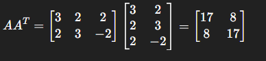
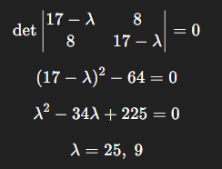
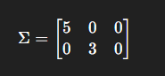
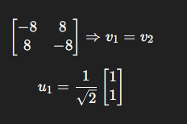
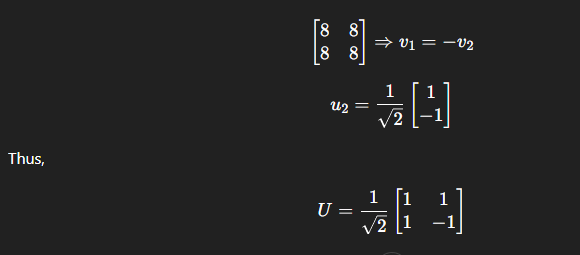
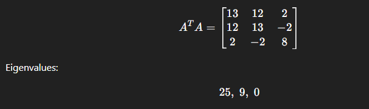
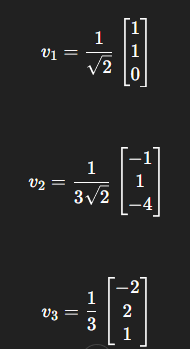
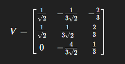
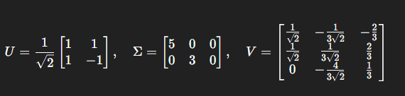

# **Q2. Singular Value Decomposition (SVD) of the Matrix**

Given

$$
A=
\begin{bmatrix}
3 & 2 & 2\
2 & 3 & -2
\end{bmatrix}
$$

---

## **Step 1: Compute $AA^T$**

$$
AA^T=
\begin{bmatrix}
3 & 2 & 2\
2 & 3 & -2
\end{bmatrix}
\begin{bmatrix}
3 & 2\
2 & 3\
2 & -2
\end{bmatrix}
=============

\begin{bmatrix}
17 & 8\
8 & 17
\end{bmatrix}
$$

---

## **Step 2: Eigenvalues of $AA^T$**

$$
\det
\begin{vmatrix}
17-\lambda & 8\
8 & 17-\lambda
\end{vmatrix}
=0
$$

$$
(17-\lambda)^2-64=0
$$

$$
\lambda^2-34\lambda+225=0
$$

$$
\lambda=25,;9
$$

So singular values are:

$$
\sigma_1=\sqrt{25}=5,
\qquad
\sigma_2=\sqrt{9}=3
$$

Hence,

$$
\Sigma=
\begin{bmatrix}
5 & 0 & 0\
0 & 3 & 0
\end{bmatrix}
$$

---

## **Step 3: Matrix $U$ (eigenvectors of $AA^T$)**

For $\lambda=25$:

$$
\begin{bmatrix}
-8 & 8\
8 & -8
\end{bmatrix}
\Rightarrow v_1=v_2
$$

$$
u_1=\frac{1}{\sqrt{2}}
\begin{bmatrix}
1\
1
\end{bmatrix}
$$

For $\lambda=9$:

$$
\begin{bmatrix}
8 & 8\
8 & 8
\end{bmatrix}
\Rightarrow v_1=-v_2
$$

$$
u_2=\frac{1}{\sqrt{2}}
\begin{bmatrix}
1\
-1
\end{bmatrix}
$$

Thus,

$$
U=\frac{1}{\sqrt{2}}
\begin{bmatrix}
1 & 1\
1 & -1
\end{bmatrix}
$$

---

## **Step 4: Matrix $V$ from $A^TA$**

$$
A^TA=
\begin{bmatrix}
13 & 12 & 2\
12 & 13 & -2\
2 & -2 & 8
\end{bmatrix}
$$

Eigenvalues:

$$
25,;9,;0
$$

Corresponding normalized eigenvectors:

For $\lambda=25$:

$$
v_1=\frac{1}{\sqrt{2}}
\begin{bmatrix}
1\
1\
0
\end{bmatrix}
$$

For $\lambda=9$:

$$
v_2=\frac{1}{3\sqrt{2}}
\begin{bmatrix}
-1\
1\
-4
\end{bmatrix}
$$

For $\lambda=0$:

$$
v_3=\frac{1}{3}
\begin{bmatrix}
-2\
2\
1
\end{bmatrix}
$$

So,

$$
V=
\begin{bmatrix}
\frac{1}{\sqrt{2}} & -\frac{1}{3\sqrt{2}} & -\frac{2}{3}[6pt]
\frac{1}{\sqrt{2}} & \frac{1}{3\sqrt{2}} & \frac{2}{3}[6pt]
0 & -\frac{4}{3\sqrt{2}} & \frac{1}{3}
\end{bmatrix}
$$

---

## **Final SVD**

$$
\boxed{
A = U\Sigma V^T
}
$$

where

$$
U=\frac{1}{\sqrt{2}}
\begin{bmatrix}
1 & 1\
1 & -1
\end{bmatrix},
\quad
\Sigma=
\begin{bmatrix}
5 & 0 & 0\
0 & 3 & 0
\end{bmatrix},
\quad
V=
\begin{bmatrix}
\frac{1}{\sqrt{2}} & -\frac{1}{3\sqrt{2}} & -\frac{2}{3}\
\frac{1}{\sqrt{2}} & \frac{1}{3\sqrt{2}} & \frac{2}{3}\
0 & -\frac{4}{3\sqrt{2}} & \frac{1}{3}
\end{bmatrix}
$$

---
