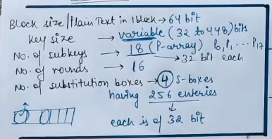
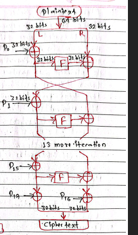
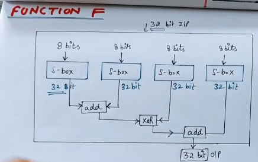

#advanced-cryptography #third-semester  

# Blowfish – Easy Exam Explanation

**Blowfish** is a **symmetric-key block cipher** designed as a fast and free alternative to DES.

It was designed by Bruce Schneier in **1993**.

---

# Definition

> **Blowfish** is a **symmetric-key block cipher** that encrypts **64-bit blocks** of data using a **variable-length key (32 to 448 bits)** and a **16-round Feistel network**.

---

# Key Features

| Feature          | Blowfish                   |
| ---------------- | -------------------------- |
| Type             | Symmetric-key block cipher |
| Designer         | Bruce Schneier             |
| Developed        | 1993                       |
| Block Size       | 64 bits                    |
| Key Size         | 32 to 448 bits (variable)  |
| Number of Rounds | 16                         |
| Structure        | Feistel Network            |
| Free to Use      | Yes (unpatented)           |




---

# Why Blowfish was Developed?

At the time:

* DES had only a **56-bit key**, making it vulnerable to brute-force attacks.
* Many strong encryption algorithms were patented or required licensing.

Blowfish was designed to be:

* Free to use
* Fast
* Secure
* Flexible

---

# Blowfish Structure

- Just Start with $P_1$ instead of $P_0$ to get exact 18 number of $P$



- *Its the function part*


```text
Plaintext (64 bits)
        │
        ▼
Split into Left (32 bits) and Right (32 bits)
        │
        ▼
      Round 1
        │
      Round 2
        │
       ...
        │
     Round 16
        │
        ▼
Ciphertext (64 bits)
```

---

# Working of Blowfish

## Step 1: Plaintext

A **64-bit plaintext** block is divided into two equal halves.

```text
64 bits

↓

Left (32 bits)

Right (32 bits)
```

---

## Step 2: Key Expansion

Before encryption begins, Blowfish generates:

### 1. P-array

Contains

```text
18 subkeys
```

called

```text
P1

P2

...

P18
```

---

### 2. Four S-boxes

Each S-box contains

```text
256 entries
```

So there are

```text
S1

S2

S3

S4
```

These are generated from the secret key.

---

## Step 3: Encryption (16 Rounds)

Each round performs:

### Round Steps

```text
Left = Left XOR P[i]

Right = Right XOR F(Left)

Swap Left and Right
```

where **F()** is Blowfish's special nonlinear function that uses the four S-boxes.

This process repeats for **16 rounds**.

After the last round, the final swap is undone and the remaining P-array values are applied to produce the ciphertext.

---

# Blowfish F Function

The **F-function** is the heart of Blowfish.

It:

* Takes a **32-bit input**.
* Splits it into **four 8-bit parts**.
* Uses the four S-boxes.
* Combines the outputs using addition and XOR.
* Produces a **32-bit output**.

```text
32-bit Input

↓

Split into 4 bytes

↓

S1   S2   S3   S4

↓

Addition + XOR

↓

32-bit Output
```

This provides strong **confusion**.

---

# Feistel Network

Blowfish uses a **Feistel network**, just like DES.

In a Feistel network:

* Data is split into two halves.
* One half is processed using the round function.
* The result is combined with the other half.
* The halves are swapped.
* This repeats for multiple rounds.

A major advantage is that **the same structure is used for both encryption and decryption**; only the order of the subkeys is reversed.

---

# Why Blowfish is Secure

Blowfish is considered secure because it uses:

* A long key (up to **448 bits**)
* 16 rounds
* Large key-dependent S-boxes
* Strong confusion and diffusion
* A Feistel structure

No practical attacks are known against the full 16-round Blowfish.

---

# Advantages

* Fast encryption
* Free and unpatented
* Variable key length (32–448 bits)
* Strong security
* Simple Feistel design
* Widely used in software

---

# Disadvantages

* **64-bit block size**, which is considered small for encrypting very large amounts of data.
* Slow key setup (key expansion takes time).
* Largely replaced in new applications by AES because AES uses a **128-bit block size**.

---

# DES vs Blowfish

| Feature    | DES        | Blowfish          |
| ---------- | ---------- | ----------------- |
| Block Size | 64 bits    | 64 bits           |
| Key Size   | 56 bits    | 32–448 bits       |
| Rounds     | 16         | 16                |
| Structure  | Feistel    | Feistel           |
| Security   | Weak today | Stronger than DES |
| Designer   | IBM        | Bruce Schneier    |

---

# Blowfish vs IDEA

| Feature         | Blowfish               | IDEA                                          |
| --------------- | ---------------------- | --------------------------------------------- |
| Block Size      | 64 bits                | 64 bits                                       |
| Key Size        | 32–448 bits            | 128 bits                                      |
| Rounds          | 16                     | 8 + output transformation                     |
| Structure       | Feistel Network        | Substitution–Permutation style                |
| Main Operations | XOR, addition, S-boxes | XOR, modular addition, modular multiplication |

---

# Easy Memory Trick

Remember Blowfish as:

**"64 – 448 – 16"**

* **64** → Block size
* **448** → Maximum key size
* **16** → Rounds

Also remember:

* **18 P-array subkeys**
* **4 S-boxes**
* **Feistel Network**

---

# Exam Answer (5 Marks)

**Blowfish** is a **symmetric-key block cipher** designed by Bruce Schneier in 1993 as a fast and free alternative to DES. It encrypts **64-bit blocks** of data using a **variable-length key from 32 to 448 bits**. Blowfish uses a **16-round Feistel network**, where each round performs XOR operations, an F-function using four S-boxes, and swapping of the left and right halves. During key expansion, it generates **18 P-array subkeys** and **4 key-dependent S-boxes**. Blowfish provides strong security due to its large key size, confusion and diffusion, and is resistant to known practical attacks on the full algorithm. However, because of its **64-bit block size**, it has largely been replaced by AES for modern applications.
