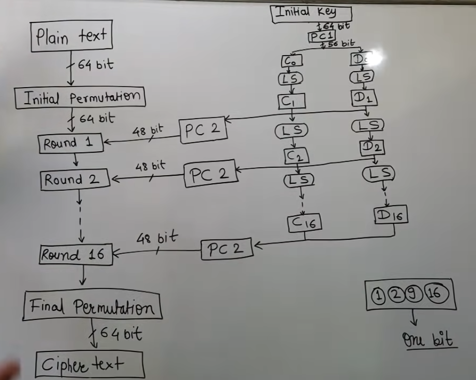
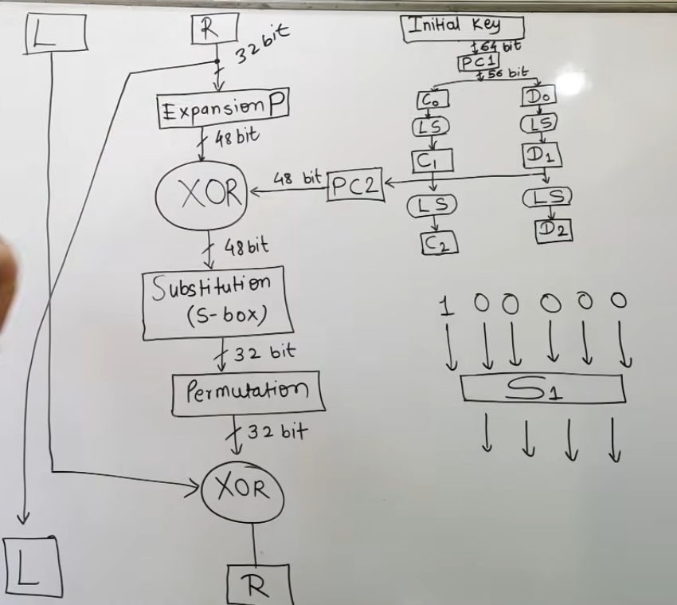

#advanced-cryptography #third-semester 

[DES](https://www.youtube.com/watch?v=8B1rN1rnTiU&list=PLYwpaL_SFmcArHtWmbs_vXX6soTK3WEJw&index=58)
[DES Rounds](https://www.youtube.com/watch?v=6Sycf0wI_q8&list=PLYwpaL_SFmcArHtWmbs_vXX6soTK3WEJw&index=60)
[Substitution Box](https://www.youtube.com/watch?v=khFqzQVuYRQ)

---

Basic Structure


What Happens in round


---
---

# Q. What is DES? Explain its working with a neat diagram.

---

# Answer

## Introduction

The **Data Encryption Standard (DES)** is a **symmetric-key block cipher** developed by IBM and adopted by NIST as a standard in **1977**.

DES encrypts **64-bit plaintext blocks** using a **56-bit secret key** (although the input key is 64 bits, 8 bits are used for parity).

Today, DES is considered **insecure** due to its short key length and has been largely replaced by **AES**.

---

# Definition

**DES (Data Encryption Standard)** is a symmetric encryption algorithm that encrypts a **64-bit plaintext block** into a **64-bit ciphertext block** using a **56-bit secret key** through **16 rounds** of encryption based on the **Feistel structure**.

---

# Features of DES

* Symmetric key algorithm.
* Block size = **64 bits**.
* Effective key size = **56 bits**.
* Number of rounds = **16**.
* Uses the **Feistel network**.
* Same key is used for encryption and decryption.

---

# DES Encryption Process

## Step 1: Initial Permutation (IP)

The 64-bit plaintext undergoes an **Initial Permutation (IP)**, which rearranges the bits according to a fixed table.

---

## Step 2: Split into Two Halves

After the initial permutation, the block is divided into:

* Left half: $$L_0$$ (32 bits)
* Right half: $$R_0$$ (32 bits)

---

## Step 3: Sixteen Feistel Rounds

For each round $$i = 1,2,\ldots,16$$:

Left half:

$$
L_i = R_{i-1}
$$

Right half:

$$
R_i = L_{i-1} \oplus F(R_{i-1}, K_i)
$$

where:

* $$K_i$$ = Round key
* $$F$$ = Feistel function

---

## Step 4: Feistel Function

The Feistel function performs four operations:

1. **Expansion (E)**
   Expands the 32-bit right half to **48 bits**.

2. **Key Mixing**
   XORs the expanded block with the 48-bit round key.

3. **Substitution (S-Boxes)**
   Compresses the 48-bit result back to **32 bits** using eight S-boxes.

4. **Permutation (P)**
   Rearranges the 32 bits.

---

## Step 5: Swap Halves

After the 16th round, the left and right halves are swapped.

---

## Step 6: Final Permutation (IP⁻¹)

A **Final Permutation**, which is the inverse of the initial permutation, is applied to produce the ciphertext.

---

# DES Structure

```text
                 Plaintext (64 bits)
                        │
                        ▼
            Initial Permutation (IP)
                        │
                        ▼
             L0 (32)         R0 (32)
                        │
             ┌────────────────────────┐
             │     16 Feistel Rounds  │
             │                        │
             │ Li = Ri-1              │
             │ Ri = Li-1 ⊕ F(Ri-1,Ki) │
             └────────────────────────┘
                        │
                        ▼
                 Swap Halves
                        │
                        ▼
          Final Permutation (IP⁻¹)
                        │
                        ▼
              Ciphertext (64 bits)
```

---

# Round Function

```text
R(i-1)
   │
Expansion (32 → 48 bits)
   │
XOR with Round Key Ki
   │
S-Boxes (48 → 32 bits)
   │
Permutation (P)
   │
Output
```

---

# Decryption

DES decryption uses the **same algorithm** as encryption.

The only difference is that the **16 round keys are applied in reverse order**:

$$
K_{16}, K_{15}, \ldots, K_1
$$

This is possible because DES uses a **Feistel structure**.

---

# Advantages

* Simple and efficient.
* Same algorithm for encryption and decryption.
* Easy hardware implementation.
* Historically very important.

---

# Disadvantages

* **56-bit key** is too short and vulnerable to brute-force attacks.
* Considered insecure today.
* Replaced by **AES** for modern applications.

---

# Applications

Historically used in:

* Banking systems
* ATM networks
* Financial transactions
* Legacy communication systems

Today, DES has mostly been replaced by AES.

---

# DES vs AES

| DES                  | AES                                   |
| -------------------- | ------------------------------------- |
| Symmetric cipher     | Symmetric cipher                      |
| 64-bit block size    | 128-bit block size                    |
| 56-bit key           | 128, 192, or 256-bit keys             |
| 16 rounds            | 10, 12, or 14 rounds                  |
| Uses Feistel network | Uses substitution–permutation network |
| Less secure          | More secure                           |

---

# Key Points to Remember

* **DES = Data Encryption Standard**.
* **Symmetric-key block cipher**.
* **64-bit plaintext → 64-bit ciphertext**.
* **56-bit effective key**.
* **16 Feistel rounds**.
* Encryption and decryption use the same algorithm, but the round keys are used in reverse order during decryption.

---

# Possible TU Exam Questions

### Short Questions (2–5 Marks)

1. Define DES.
2. What is the block size and key size of DES?
3. Why is DES considered insecure?
4. What is the role of the Feistel structure in DES?

### Long Questions (8–10 Marks)

1. **Explain the DES algorithm with a neat diagram.**
2. **Describe the working of the Feistel function in DES.**
3. **Compare DES and AES.**

---

# Memory Trick

```text
Plaintext (64 bits)
        │
        ▼
Initial Permutation
        │
        ▼
Split into L0 and R0
        │
        ▼
16 Feistel Rounds
        │
        ▼
Swap Halves
        │
        ▼
Final Permutation
        │
        ▼
Ciphertext (64 bits)
```

Remember these facts:

* **Block size:** $$64 \text{ bits}$$
* **Effective key size:** $$56 \text{ bits}$$
* **Rounds:** $$16$$
* **Structure:** **Feistel Network**
