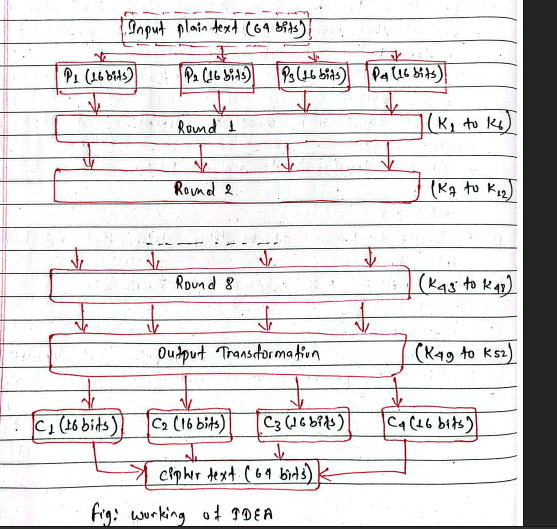

#advanced-cryptography #third-semester 

# IDEA (International Data Encryption Algorithm)

**IDEA** stands for **International Data Encryption Algorithm**.

It is a **symmetric-key block cipher** designed to provide strong encryption and was developed as an improvement over DES.

---

# Definition

> **IDEA (International Data Encryption Algorithm)** is a **symmetric-key block cipher** that encrypts 64-bit blocks of data using a **128-bit key** through a series of substitution and mixing operations.

---

# Key Features

| Feature          | IDEA                                                 |
| ---------------- | ---------------------------------------------------- |
| Full Form        | International Data Encryption Algorithm              |
| Type             | Symmetric-key block cipher                           |
| Block Size       | 64 bits                                              |
| Key Size         | 128 bits                                             |
| Number of Rounds | 8 full rounds + 1 output transformation (half round) |
| Developed        | 1991                                                 |
| Designers        | Xuejia Lai and James Massey                          |

---

# Why was IDEA developed?

DES had two major problems:

* Small **56-bit key**
* Vulnerable to brute-force attacks

IDEA was designed to overcome these problems by using a much larger **128-bit key** and stronger encryption operations.

---

# IDEA Structure



```text
Plaintext (64 bits)
        │
        ▼
   Divide into 4 parts
 (16 bits each)
        │
        ▼
      Round 1
        │
      Round 2
        │
        .
        .
        .
      Round 8
        │
        ▼
 Output Transformation
        │
        ▼
Ciphertext (64 bits)
```

---

# Working of IDEA

## Step 1: Plaintext

The plaintext block is

```text
64 bits
```

It is divided into

```text
16 bits
16 bits
16 bits
16 bits
```

or

```text
X1

X2

X3

X4
```

---

## Step 2: Generate Subkeys

From the **128-bit secret key**, IDEA generates

```text
52 subkeys
```

Each subkey is

```text
16 bits
```

These subkeys are used throughout the encryption process.

---

## Step 3: Perform 8 Rounds

Each round uses **6 subkeys** and performs several mathematical operations.

The three main operations are:

### 1. XOR (Exclusive OR)

```text
1010

1100

↓

0110
```

---

### 2. Addition Modulo (2^{16})

Numbers are added modulo **65536**.

Example

```text
65000 + 1000

↓

66000

↓

464
```

because

```text
66000 mod 65536 = 464
```

---

### 3. Multiplication Modulo (2^{16}+1)

Instead of ordinary multiplication,

IDEA uses

```text
mod 65537
```

Example

```text
200 × 300

↓

60000 mod 65537

↓

60000
```

These three different operations make IDEA highly resistant to cryptanalysis because they mix data in different mathematical ways.

---

## Step 4: Output Transformation

After completing the **8 rounds**, IDEA performs a final output transformation (sometimes called the half round) using **4 additional subkeys**.

This produces the final **64-bit ciphertext**.

---

# Why IDEA is Secure

IDEA combines three different operations:

* XOR
* Modular Addition
* Modular Multiplication

These operations belong to different algebraic groups, making it very difficult for attackers to find useful mathematical relationships.

It also uses:

* 128-bit key
* Multiple rounds
* Confusion
* Diffusion

---

# Advantages

* Strong 128-bit key
* Resistant to differential cryptanalysis
* Resistant to linear cryptanalysis
* Faster and more secure than DES
* No practical attacks on the full IDEA algorithm are known

---

# Disadvantages

* Slower than some modern ciphers
* More complex than DES
* Patent restrictions existed in the past (now expired)

---

# DES vs IDEA

| Feature         | DES                            | IDEA                                          |
| --------------- | ------------------------------ | --------------------------------------------- |
| Full Form       | Data Encryption Standard       | International Data Encryption Algorithm       |
| Key Size        | 56 bits                        | 128 bits                                      |
| Block Size      | 64 bits                        | 64 bits                                       |
| Rounds          | 16                             | 8 + Output Transformation                     |
| Main Operations | XOR, substitution, permutation | XOR, modular addition, modular multiplication |
| Security        | Weak today due to short key    | Much stronger than DES                        |

---

# Easy Memory Trick

Remember IDEA with the number **"64-128-8"**:

* **64** → Block size (64 bits)
* **128** → Key size (128 bits)
* **8** → Main rounds (plus one output transformation)

Also remember the **three operations**:

**XAM**

* **X** → XOR
* **A** → Addition (mod (2^{16}))
* **M** → Multiplication (mod (2^{16}+1))

---

# Exam Answer (5 Marks)

**IDEA (International Data Encryption Algorithm)** is a symmetric-key block cipher developed by Xuejia Lai and James Massey in 1991. It encrypts **64-bit blocks** using a **128-bit key**. The algorithm consists of **8 rounds followed by a final output transformation**. During encryption, it uses three operations: **XOR**, **modular addition (mod (2^{16}))**, and **modular multiplication (mod (2^{16}+1))**. The combination of these operations provides strong confusion and diffusion, making IDEA highly resistant to linear and differential cryptanalysis. Because of its larger key size and stronger design, IDEA is more secure than DES.
