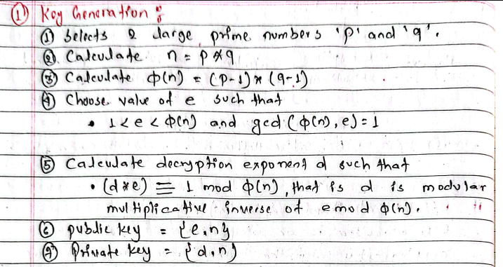

#advanced-cryptography #third-semester 



# What is RSA?

**RSA** is a **public-key (asymmetric) cryptographic algorithm** used for:

* Encryption
* Decryption
* Digital Signatures
* Secure Key Exchange

It was invented in **1977** by:

* Ron Rivest
* Adi Shamir
* Leonard Adleman

The name **RSA** comes from the first letter of each inventor's surname.

---

# Why RSA was Developed?

In **symmetric encryption**:

```text id="x6n8qr"
Alice -------- Secret Key -------- Bob
```

The biggest problem is:

> **How do Alice and Bob securely share the secret key?**

RSA solves this by using **two keys**.

---

# Two Keys in RSA

Every user has:

### 1. Public Key

* Shared with everyone.
* Used for encryption.

Example

```text id="2wtls4"
Public Key = (e, n)
```

---

### 2. Private Key

* Kept secret.
* Used for decryption.

Example

```text id="gkdzql"
Private Key = (d, n)
```

---

# RSA Working

```text id="jlwmgv"
             Receiver

     Public Key (e,n)
            │
            ▼
Sender → Encrypt Plaintext
            │
            ▼
        Ciphertext
            │
            ▼
Receiver → Decrypt using
        Private Key (d,n)
            │
            ▼
         Plaintext
```

---

# RSA Algorithm

RSA has **3 phases**:

1. Key Generation
2. Encryption
3. Decryption

---

# Phase 1: Key Generation

This is done only once.

---

## Step 1

Choose two prime numbers

```text id="4uv5mx"
p

q
```

Example

```text id="w9zjlwm"
p = 7

q = 11
```

---

## Step 2

Calculate

```text id="1g3xwj"
n = p × q
```

Example

```text id="tpkz4e"
7 × 11 = 77
```

So,

```text id="4g3ept"
n = 77
```

---

## Step 3

Calculate Euler Totient

Formula

$$
\phi(n)=(p-1)(q-1)
$$

Example

```text id="uux6kn"
(7−1)(11−1)

6 × 10

60
```

So,

```text id="vrcmiv"
φ(n)=60
```

---

## Step 4

Choose Public Key

Choose

```text id="2jlwm5"
e
```

such that

$$
1<e<\phi(n)
$$

$$
\gcd(e,\phi(n))=1
$$

Choose

```text id="3l89zv"
e = 7
```

because

$$
\gcd(7,60)=1
$$

---

## Step 5

Find Private Key

Find

```text id="3b0llr"
d
```

such that

$$
d\times e\equiv1\pmod{\phi(n)}
$$

Need

$$
d\times7\equiv1\pmod{60}
$$

Answer

```text id="l4wmgj"
d=43
```

because

```text id="hj8xrt"
43×7=301

301 mod60=1
```

---

Now we have

### Public Key

```text id="ezrcp3"
(7,77)
```

### Private Key

```text id="qujlwm"
(43,77)
```

---

# Encryption

Formula

$$
C=M^e\bmod n
$$

where

* $M$ = Plaintext
* $C$ = Ciphertext

---

Example

Plaintext

```text id="g2kfj5"
M=9
```

Public Key

```text id="k8vl7j"
e=7

n=77
```

Encryption

$$
C=9^7\bmod77
$$

The answer is

```text id="mhqww5"
C=37
```

So

```text id="t50xxr"
Plaintext =9

Ciphertext =37
```

---

# Decryption

Formula

$$
M=C^d\bmod n
$$

Use

```text id="djlwmk"
C=37

d=43

n=77
```

Result

```text id="ah67bl"
M=9
```

Original message is recovered.

---

# Complete Flow

```text id="eq3a0w"
Choose p,q

↓

Find n=pq

↓

Find φ(n)

↓

Choose e

↓

Find d

↓

Public Key=(e,n)

Private Key=(d,n)

↓

Encryption

C=M^e mod n

↓

Decryption

M=C^d mod n
```

---

# Why RSA is Secure

Suppose someone knows

```text id="9q0jlwm"
Public Key

(7,77)
```

They know

```text id="6cnigx"
n=77
```

To find the private key,

they must factor

```text id="7p46f8"
77

↓

7×11
```

This is easy because the numbers are small.

Real RSA uses numbers with **hundreds or thousands of bits**, making factorization extremely difficult.

---

# Advantages

* Secure communication
* Solves key distribution problem
* Supports digital signatures
* Supports authentication
* Supports encryption and decryption

---

# Disadvantages

* Slower than symmetric algorithms
* Uses large keys
* Requires more computation
* Not suitable for encrypting very large amounts of data directly (often used to encrypt a symmetric session key instead)

---

# Security of RSA

### 1. Brute Force Attack

Try every possible private key.

Very difficult because RSA keys are extremely large.

---

### 2. Mathematical Attack

Try to factor

```text id="6fq1zw"
n=p×q
```

If $p$ and $q$ are found,

the attacker can compute the private key.

RSA's security mainly depends on the difficulty of this factorization problem.

---

### 3. Timing Attack

The attacker measures how long decryption takes.

Different execution times may leak information about the private key.

---

### 4. Chosen Ciphertext Attack

The attacker sends specially crafted ciphertexts to be decrypted and analyzes the outputs to infer information about the key.

Modern padding schemes (such as OAEP) help prevent this attack.

---

# RSA Example (Very Small Numbers)

| Step          | Value   |
| ------------- | ------- |
| $p$           | 7       |
| $q$           | 11      |
| $n=p\times q$ | 77      |
| $\phi(n)$     | 60      |
| $e$           | 7       |
| $d$           | 43      |
| Public Key    | (7,77)  |
| Private Key   | (43,77) |

---

# Easy Memory Trick

Remember these **4 formulas**:

### 1. Find $n$

$$
n=p\times q
$$

### 2. Find $\phi(n)$

$$
\phi(n)=(p-1)(q-1)
$$

### 3. Encryption

$$
C=M^e\bmod n
$$

### 4. Decryption

$$
M=C^d\bmod n
$$

**Memory Trick:** **"n → φ → e → d → Encrypt → Decrypt"**

---

# Exam Answer (5 Marks)

**RSA (Rivest–Shamir–Adleman)** is a **public-key cryptographic algorithm** developed by Ron Rivest, Adi Shamir, and Leonard Adleman in 1977. It uses **two keys**: a **public key** for encryption and a **private key** for decryption. During **key generation**, two prime numbers $p$ and $q$ are selected, $$n=p\times q$$ and $$\phi(n)=(p-1)(q-1)$$ are computed, a public exponent $e$ is chosen, and a private exponent $d$ is calculated such that

$$
d\times e\equiv1\pmod{\phi(n)}.
$$

Encryption is performed using

$$
C=M^e\bmod n,
$$

and decryption uses

$$
M=C^d\bmod n.
$$

RSA is widely used for **secure communication, digital signatures, and key exchange**. Its security relies on the computational difficulty of **factoring large prime numbers**.
