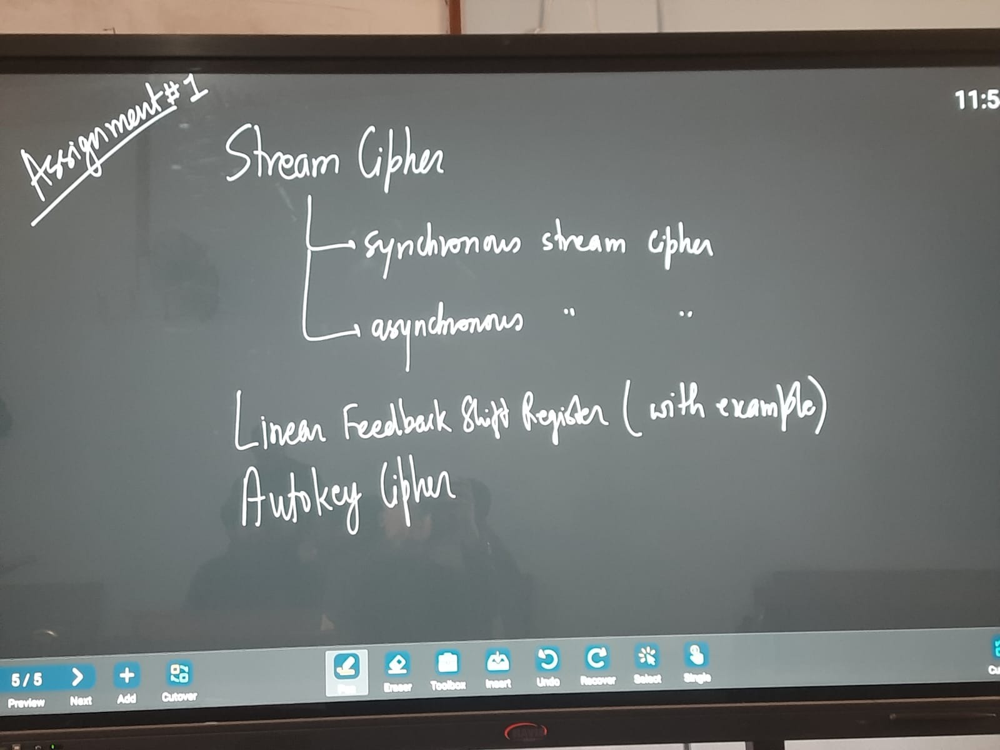

**Assignment 1**

1. Stream Cipher
- synchronous stream cipher
- asynchronous stream cipher 

2. Linear Feedback Shift Register (with example)

3. Autokey Cipher

---
## Answer
[Stream Cipher-LFSR-Autokey Cipher](AC-Assignments/Stream%20Cipher-LFSR-Autokey%20Cipher.md)

# Tag
#third-semester #advanced-cryptography #assignment 