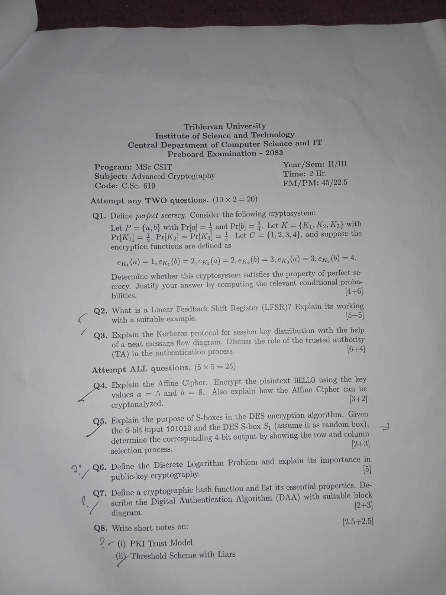

#old-que #third-semester #advanced-cryptography 

---

**Q1.** Define *perfect secrecy*. Consider the following cryptosystem:

Let $P = \{a, b\}$ with $\operatorname{Pr}[a] = \frac{1}{4}$ and $\operatorname{Pr}[b] = \frac{3}{4}$. Let $K = \{K_1, K_2, K_3\}$ with $\operatorname{Pr}[K_1] = \frac{1}{2}$, $\operatorname{Pr}[K_2] = \operatorname{Pr}[K_3] = \frac{1}{4}$. Let $C = \{1, 2, 3, 4\}$, and suppose the encryption functions are defined as

$$e_{K_1}(a) = 1, e_{K_1}(b) = 2, e_{K_2}(a) = 2, e_{K_2}(b) = 3, e_{K_3}(a) = 3, e_{K_3}(b) = 4.$$

Determine whether this cryptosystem satisfies the property of perfect secrecy. Justify your answer by computing the relevant conditional probabilities.
[4+6]

- [Perfect Secrecy Numerical](Perfect%20Secrecy%20Numerical.md)

---