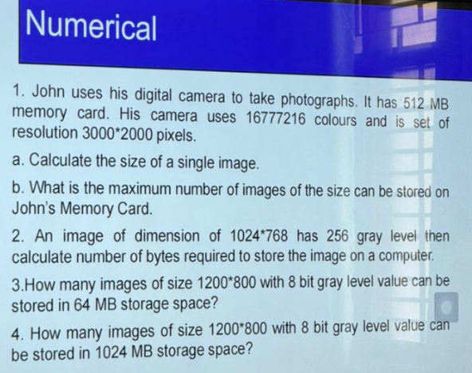

#ippr #assignment #third-semester 
# Question

---
# Answer

## 1. John’s Digital Camera

Given:

* Memory card = **512 MB**
* Colors = **16777216 colors**
* Resolution = **3000 × 2000 pixels**

---

### Step 1: Find Bits per Pixel

Number of colors = **16777216**

We know:

$$16777216=2^{24}$$

So,

$$bits\ per\ pixel=24$$

(24-bit color image)

---

### (a) Size of a Single Image

#### Step 1: Total Pixels

$$pixels=3000\times2000$$

$$pixels=6000000$$

---

#### Step 2: Total Bits

$$bits=pixels\times bits\ per\ pixel$$

$$bits=6000000\times24$$

$$bits=144000000$$

---

#### Step 3: Convert Bits → Bytes

$$bytes=\frac{bits}{8}$$

$$bytes=\frac{144000000}{8}$$

$$bytes=18000000$$

---

#### Step 4: Convert Bytes → MB

$$MB=\frac{bytes}{1024\times1024}$$

$$MB=\frac{18000000}{1048576}$$

$$MB\approx17.17$$

✅ **Size of one image ≈ 17.2 MB**

---

### (b) Maximum Images Stored

Memory card = **512 MB**

$$images=\frac{512}{17.17}$$

$$images\approx29.8$$

We take the integer value.

✅ **Maximum images = 29**

---

## 2. Image Storage (1024×768, 256 Gray Levels)

Given:

* Resolution = **1024 × 768**
* Gray levels = **256**

---

### Step 1: Bits per Pixel

$$256=2^8$$

So

$$bits\ per\ pixel=8$$

---

### Step 2: Pixels

$$pixels=1024\times768$$

$$pixels=786432$$

---

### Step 3: Bits Required

$$bits=786432\times8$$

$$bits=6291456$$

---

### Step 4: Convert to Bytes

$$bytes=\frac{6291456}{8}$$

$$bytes=786432$$

---

### Convert to KB

$$KB=\frac{786432}{1024}$$

$$KB=768$$

✅ **Storage required = 786432 Bytes = 768 KB**

---

## 3. Images Stored in 64 MB

Given:

* Image size = **1200 × 800**
* Gray level = **8 bit**
* Storage = **64 MB**

---

### Step 1: Pixels

$$pixels=1200\times800$$

$$pixels=960000$$

---

### Step 2: Bits

$$bits=960000\times8$$

$$bits=7680000$$

---

### Step 3: Bytes

$$bytes=\frac{7680000}{8}$$

$$bytes=960000$$

---

### Step 4: Convert to MB

$$MB=\frac{960000}{1048576}$$

$$MB\approx0.915$$

Size of one image ≈ **0.915 MB**

---

### Step 5: Images in 64 MB

$$images=\frac{64}{0.915}$$

$$images\approx69.9$$

✅ **Maximum images ≈ 69**

---

## 4. Images Stored in 1024 MB

Image size from previous question:

$$1\ image\approx0.915MB$$

---

### Calculate

$$images=\frac{1024}{0.915}$$

$$images\approx1119$$

✅ **Maximum images ≈ 1119**

---

## 📊 Final Answers

| Question | Answer                     |
| -------- | -------------------------- |
| 1(a)     | **17.2 MB per image**      |
| 1(b)     | **29 images**              |
| 2        | **786432 Bytes (768 KB)**  |
| 3        | **69 images in 64 MB**     |
| 4        | **1119 images in 1024 MB** |

---

✅ **Important Formula for Exams**

Image size:

$$ImageSize=\frac{Width \times Height \times BitsPerPixel}{8}$$

Memory images stored:

$$Images=\frac{TotalStorage}{SingleImageSize}$$

---
# Shorter
---

## Question 1
John uses his digital camera to take photographs. It has a 512 MB memory card. His camera uses 16,777,216 colours and is set at resolution 3000×2000 pixels.

### Key Info:
- 16,777,216 = 2²⁴ → **24 bits per pixel** (bit depth)
- Resolution = 3000 × 2000 = 6,000,000 pixels

### a. Size of a single image:
> Size = pixels × bit depth ÷ 8 (to convert to bytes)

= 6,000,000 × 24 ÷ 8
= 6,000,000 × 3
= **18,000,000 bytes = 18 MB**

### b. Maximum number of images on 512 MB card:
= 512 MB ÷ 18 MB
= **28 images** (rounded down)

---

## Question 2
An image of dimension 1024×768 has 256 gray levels. Calculate bytes required.

### Key Info:
- 256 gray levels = 2⁸ → **8 bits per pixel**
- Resolution = 1024 × 768 = 786,432 pixels

> Size = 786,432 × 8 ÷ 8 = **786,432 bytes ≈ 768 KB**

---

## Question 3
How many images of size 1200×800 with 8-bit gray level can be stored in **64 MB**?

- Image size = 1200 × 800 × 8 ÷ 8 = **960,000 bytes = ~0.915 MB**
- 64 MB = 64 × 1024 × 1024 = 67,108,864 bytes
- Number of images = 67,108,864 ÷ 960,000 = **≈ 69 images**

---

## Question 4
How many images of size 1200×800 with 8-bit gray level can be stored in **1024 MB**?

- Image size = 960,000 bytes (same as above)
- 1024 MB = 1,073,741,824 bytes
- Number of images = 1,073,741,824 ÷ 960,000 = **≈ 1,118 images**

---
# Tag
#third-semester #IPPR #assignment 