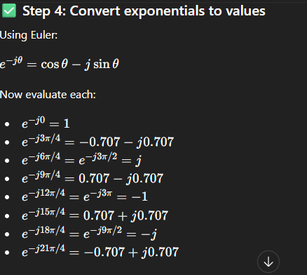

f(x)={3,2,5,1,4,5,0,2}. Find DFT(Discrete Fourier Transformation)

---
# ✅ Question

Calculate the DFT of:

$$f(x)={3,2,3,1,4,5,0,2},\quad N=8$$

---

# ✅ Formula

$$F(u)=\sum_{x=0}^{7} f(x)e^{-j2\pi ux/8},\quad u=0,1,\dots,7$$

---

# ✅ Calculation

## 🔹 1. For $u=0$

$$F(0)=\sum f(x)$$

$$=3+2+3+1+4+5+0+2=20$$

---

## 🔹 2. For $u=1$

$$F(1)=\sum_{x=0}^{7} f(x)e^{-j2\pi x/8}$$

$$=3(1)+2(0.707-j0.707)+3(-j)+1(-0.707-j0.707)+4(-1)+5(-0.707+j0.707)+0+2(0.707+j0.707)$$

**Real part:**

$$=3+1.414-0.707-4-3.535+1.414=-2.414$$

**Imaginary part:**

$$=-1.414-3-0.707+3.535+1.414=-0.172$$

$$F(1)=-2.414-j0.172$$

---

## 🔹 3. For $u=2$

$$F(2)=\sum f(x)e^{-j2\pi(2)x/8}$$

Using:

$$e^{-j\pi/2}=-j,\quad e^{-j\pi}=-1,\quad e^{-j3\pi/2}=j$$

$$F(2)=3+2(-j)+3(-1)+1(j)+4(1)+5(j)+0+2(-j)$$
- [Here how e value becomes 1 in 4?](IPPR-Assignments/Here%20how%20e%20value%20becomes%201%20in%204.md)

**Real part:**

$$=3-3+4=4$$

**Imaginary part:**

$$=-2+1+5-2=2$$

$$F(2)=4+j2$$

---

## 🔹 4. For $u=3$
- [Expanded for this part](IPPR-Assignments/Expanded%20for%20this%20part.md)

$$F(3)=\sum f(x)e^{-j2\pi(3)x/8}$$

$$F(3)=0.414+j5.828$$

---

## 🔹 5. For $u=4$

$$F(4)=\sum f(x)(-1)^x$$

$$=3-2+3-1+4-5+0-2=0$$

---

## 🔹 Remaining values (Conjugate Property)
[Conjugate Meaning](IPPR-Assignments/Expanded%20for%20this%20part.md)

$$F(5)=0.414-j5.828$$

$$F(6)=4-j2$$

$$F(7)=-2.414+j0.172$$

---

# ✅ Final Answer

$$F(u)={20,,-2.414-j0.172,,4+j2,,0.414+j5.828,,0,,0.414-j5.828,,4-j2,,-2.414+j0.172}$$

---

# ✅ If $\frac{1}{N}$ is used

Divide all values by $8$:

$$F(u)={2.5,,-0.302-j0.021,,0.5+j0.25,,0.052+j0.728,,0,,0.052-j0.728,,0.5-j0.25,,-0.302+j0.021}$$

---

# ✅ Viva Line

“DFT converts a discrete signal into frequency components using complex exponentials. Each coefficient is obtained by multiplying input samples with complex exponentials and summing real and imaginary parts.”

---
