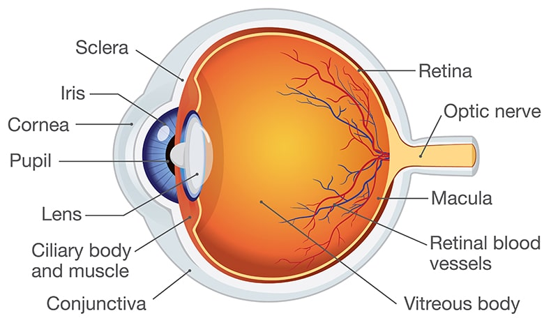

#ippr #third-semester 

# Unit 1: Introduction to Digital Image Processing

## 1. Digital Image

### Definition

A **digital image** is a picture represented as a collection of tiny dots called **pixels** arranged in rows and columns.

* Pixel = Smallest element of an image.
* Each pixel stores an intensity (brightness) or color value.

### Examples

* Mobile phone photos
* X-ray images
* Satellite images
* CCTV images

### Representation

A digital image is represented as

$$[
f(x,y)
]$$

where

* **x** = horizontal coordinate
* **y** = vertical coordinate
* **f(x,y)** = intensity (brightness) at that pixel

---

## 2. Fundamental Steps in Digital Image Processing

Digital image processing consists of several steps.

```
Image Acquisition
        ↓
Image Enhancement
        ↓
Image Restoration
        ↓
Color Image Processing
        ↓
Wavelets & Compression
        ↓
Morphological Processing
        ↓
Segmentation
        ↓
Feature Extraction
        ↓
Recognition & Interpretation
```

### (1) Image Acquisition

* Capture image using camera or scanner.
* Convert it into digital form.

Example:
Taking a photo using a mobile phone.

---

### (2) Image Enhancement

Improves image quality for better viewing.

Examples

* Increase brightness
* Improve contrast
* Remove noise

---

### (3) Image Restoration

Restores degraded images using mathematical techniques.

Examples

* Remove blur
* Remove motion distortion

---

### (4) Color Image Processing

Processes color images.

Examples

* RGB image processing
* Color correction

---

### (5) Image Compression

Reduces image size for storage and transmission.

Example:
JPEG compression

---

### (6) Morphological Processing

Processes image shape.

Operations:

* Dilation
* Erosion

Used for:

* Object extraction
* Boundary detection

---

### (7) Image Segmentation

Divides an image into meaningful regions.

Example:
Separating a person from the background.

---

### (8) Feature Extraction

Extracts important characteristics.

Examples

* Shape
* Edge
* Texture
* Color

---

### (9) Recognition and Interpretation

Identifies objects.

Examples

* Face recognition
* Fingerprint recognition
* OCR

---

## Exam Definition

**Digital Image Processing (DIP):**

> Digital Image Processing is the process of manipulating digital images using a computer to improve image quality or extract useful information.

---

# 3. Elements of Digital Image Processing System

A digital image processing system consists of:

```
Image Sensor
      ↓
Digitizer
      ↓
Computer
      ↓
Image Processing Software
      ↓
Storage
      ↓
Display
      ↓
Printer / Network
```

### Components

### 1. Image Sensor

Captures the image.

Examples

* Camera
* Scanner
* Satellite sensor

---

### 2. Digitizer

Converts analog image into digital form.

---

### 3. Computer

Processes the image.

Performs

* Filtering
* Compression
* Enhancement

---

### 4. Software

Algorithms used for processing.

Examples

* MATLAB
* OpenCV
* Python

---

### 5. Storage

Stores images.

Examples

* Hard disk
* SSD
* Cloud

---

### 6. Display

Shows processed images.

Examples

* Monitor
* LCD
* LED

---

### 7. Printer / Network

Used for printing or transmitting images.

---

# 4. Elements of Visual Perception

Digital image processing is based on how humans see images.

The human eye mainly consists of

* Cornea
* Iris
* Pupil
* Lens
* Retina
* Optic nerve

### Functions

### Cornea

Protects the eye and bends incoming light.

### Iris

Controls the amount of light entering the eye.

### Pupil

Opening through which light enters.

### Lens

Focuses light on the retina.

### Retina

Contains light-sensitive cells.

Two types:

### Rods

* Detect brightness
* Work in dim light
* Black and white vision

### Cones

* Detect colors
* Work in bright light
* Red, Green, Blue

### Optic Nerve

Carries visual information to the brain.



---

# 5. Digital Image Fundamentals

## A Simple Image Model

A digital image is represented as

$$[\space
f(x,y)
\space]$$

where

* x = row position
* y = column position
* f(x,y) = intensity

For grayscale images

Pixel values

```
0   → Black

255 → White
```

(For an 8-bit image)

---

## Types of Images

### Binary Image

Only two values

```
0 = Black

1 = White
```

---

### Grayscale Image

Pixel values

```
0 – 255
```

---

### Color Image

Uses RGB channels

* Red
* Green
* Blue

Each ranges from 0–255.

---

# 6. Sampling and Quantization

These convert a continuous image into a digital image.

---

## Sampling

### Definition

Sampling divides the image into pixels.

It determines **spatial resolution**.

Higher sampling means

* More pixels
* Better detail

Example

```
4 × 4 image

↓

8 × 8 image

More pixels
```

---

## Quantization

### Definition

Assigns intensity values to sampled pixels.

Determines **gray-level resolution**.

Example

```
2 Levels

Black
White

4 Levels

0
85
170
255
```

Higher quantization gives smoother images.

---

## Difference

| Sampling                         | Quantization                   |
| -------------------------------- | ------------------------------ |
| Divides image into pixels        | Assigns intensity values       |
| Controls spatial resolution      | Controls gray-level resolution |
| Horizontal & vertical resolution | Brightness resolution          |

---

# 7. Basic Relationships Between Pixels

Pixels have different relationships.

---

## (1) Neighbors

For pixel P(x,y)

### 4-Neighbours

```
   N
W  P  E
   S
```

Coordinates

```
(x−1,y)

(x+1,y)

(x,y−1)

(x,y+1)
```

---

### Diagonal Neighbours

```
NW     NE

   P

SW     SE
```

---

### 8-Neighbours

Combination of

* 4-neighbours
* Diagonal neighbours

Total = 8 neighbours.

---

## (2) Adjacency

Used to determine connected pixels.

Types

### 4-Adjacency

Only four neighbours.

---

### 8-Adjacency

Includes diagonal neighbours.

---

### m-Adjacency

Modified adjacency to avoid ambiguity in diagonal connections.

---

## (3) Connectivity

Describes how pixels are connected.

Examples

* Object detection
* Region filling

---

## (4) Distance Measures

### Euclidean Distance

Shortest straight-line distance.

Formula

$$[
D=\sqrt{(x_1-x_2)^2+(y_1-y_2)^2}
]$$

---

### City Block Distance (D4)

Only horizontal and vertical movement.

$$[
D=|x_1-x_2|+|y_1-y_2|
]$$

---

### Chessboard Distance (D8)

Allows diagonal movement.

$$[
D=\max(|x_1-x_2|,;|y_1-y_2|)
]$$

---

# 8. Image Geometry Transforms in 2D

Geometric transformations change the position, size, or orientation of an image.

---

## (1) Translation

Moves image from one location to another.

```
(x,y)

↓

(x+tx, y+ty)
```

---

## (2) Rotation

Rotates image by an angle θ.

Example

* 90°
* 180°
* 270°

---

## (3) Scaling

Changes image size.

* Zoom In
* Zoom Out

---

## (4) Reflection (Flipping)

Mirror image.

Types

* Horizontal flip
* Vertical flip

---

## (5) Shearing

Slants the image.

Objects appear tilted.

---

# Very Important Exam Questions

### 2 Marks

* Define digital image.
* What is a pixel?
* Define sampling.
* Define quantization.
* What is image enhancement?
* Define image segmentation.
* What is a grayscale image?
* What are rods and cones?

### 5 Marks

* Explain the fundamental steps of Digital Image Processing.
* Explain the elements of a Digital Image Processing system.
* Explain sampling and quantization with examples.
* Explain basic relationships between pixels.
* Explain image geometry transformations.

### 10 Marks

* Explain the complete Digital Image Processing system with a neat diagram.
* Explain all fundamental steps of Digital Image Processing with suitable examples.
* Explain digital image fundamentals, sampling, quantization, and pixel relationships.
* Explain 2D geometric transformations with examples.

**Exam Tip:** A simple flow diagram for the **fundamental steps** and a labeled sketch of the **human eye** or **image processing system** can help you earn extra marks in descriptive questions.
