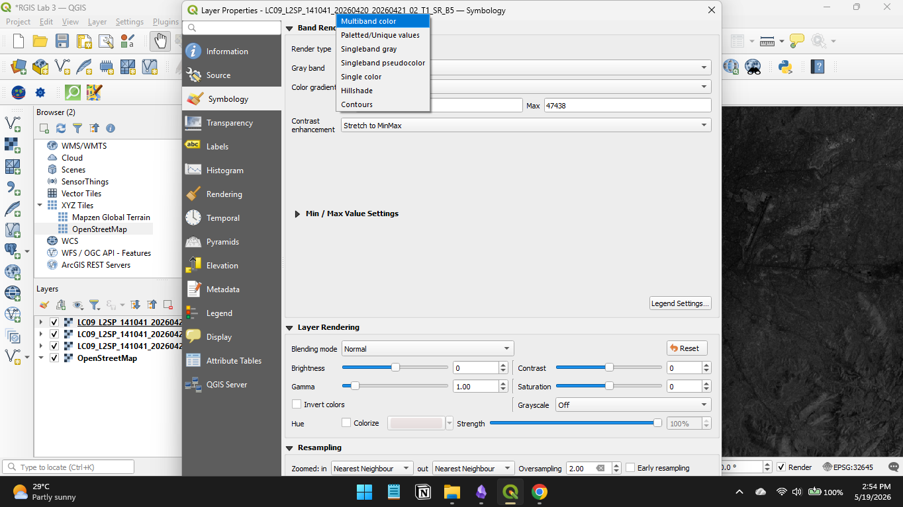

#lab #assignment #RGIS #third-semester 

- [Understanding the flow of the lab](Understanding%20the%20flow%20of%20the%20lab.md)
# Remote Sensing & Image Classification Using QGIS (Landsat 8/9)

## Study Area

For this assignment, you can use **Kathmandu Valley, Nepal** as the study area because it contains urban areas, vegetation, water bodies, and barren land, making classification easier.

---

# i. Download a 30 m Resolution Landsat Image

Use Landsat 8 or Landsat 9 imagery from:

* [USGS EarthExplorer](https://earthexplorer.usgs.gov?utm_source=chatgpt.com)
* [USGS Landsat Collection](https://www.usgs.gov/landsat-missions?utm_source=chatgpt.com)

### Steps

1. Open EarthExplorer.
2. Create/login to your USGS account.
3. Search for **Kathmandu, Nepal**.
4. Under **Data Sets**:

   * Select:

     * Landsat Collection 2
     * Landsat 8-9 OLI/TIRS
     * Level-1
5. Choose a cloud-free image (<10% cloud cover preferred).
6. Download the **GeoTIFF** product.

### Recommended Bands

For False Color Composite:

* Band 5 → Near Infrared (NIR)
* Band 4 → Red
* Band 3 → Green

---

# ii. Load Bands in QGIS and Create FCC

## Steps in QGIS

1. Open QGIS.
2. Go to:

   * **Layer → Add Layer → Add Raster Layer**

1. Load Bands:

   * B5
   * B4
   * B3

## Create FCC

1. Right-click raster → **Properties**
2. Select **Symbology**
3. Choose:

   * Render type = *Multiband color*

1. Assign:

   * Red = Band 5
   * Green = Band 4
   * Blue = Band 3

### Interpretation

* Vegetation → Bright Red
* Urban Areas → Cyan/Gray
* Water → Dark Blue/Black

---

# iii. Apply Image Enhancement Techniques

## 1. Contrast Stretching

### Steps

1. Raster Properties → Symbology
2. Min/Max Value Settings
3. Select:

   * Stretch to MinMax
   * Cumulative Count Cut (2%)

### Result

* Improves brightness and contrast
* Makes land cover features more visible

---

## 2. Histogram Equalization

### Steps

1. Open:

   * Raster → Miscellaneous → Build Virtual Raster
   * Or use Raster Calculator plugins/tools
2. Use histogram equalization from processing toolbox.

### Result

* Enhances tonal variation
* Improves visibility of subtle details

### Comparison

| Technique              | Effect                   |
| ---------------------- | ------------------------ |
| Contrast Stretching    | Improves global contrast |
| Histogram Equalization | Enhances local detail    |

---

# iv. Apply Spatial Filters

## A. Low-Pass Filter (Smoothing)

### Purpose

* Removes noise
* Smoothens image

### Steps

Use:

* Processing Toolbox → SAGA/GRASS → Convolution Filter

Kernel Example:
$$[
\frac{1}{9}
\begin{bmatrix}
1&1&1\\
1&1&1\\
1&1&1
\end{bmatrix}
]$$

### Result

* Blurred image
* Reduced high-frequency information

---

## B. High-Pass Filter (Edge Detection)

### Purpose

* Enhances edges and boundaries

Kernel Example:
$$[
\begin{bmatrix}
-1&-1&-1\\
-1&8&-1\\
-1&-1&-1
\end{bmatrix}
]$$

### Result

* Roads/buildings become sharper
* Boundaries highlighted

---

# v. Perform Land Use/Land Cover Classification

## Recommended Method

Use **Unsupervised Classification (K-Means)** if you are beginner-friendly.

### Steps

1. Install:

   * Semi-Automatic Classification Plugin (SCP)
2. Open SCP Dock.
3. Select:

   * K-Means Classification
4. Choose:

   * Number of classes = 4 or 5

## Suggested Classes

* Urban/Built-up
* Vegetation
* Water
* Bare Soil

---

## Alternative: Supervised Classification

If required:

1. Create training samples (ROI).
2. Use:

   * Maximum Likelihood Classification

---

# vi. Create Final Map Layout

In QGIS:

1. Go to:

   * **Project → New Print Layout**
2. Add:

   * Original FCC image
   * Enhanced image
   * Filtered image
   * Classified map

## Include:

* Title
* North Arrow
* Scale Bar
* Legend
* Coordinate Grid

### Suggested Layout

| Map            | Description          |
| -------------- | -------------------- |
| Original Image | FCC Landsat          |
| Enhanced Image | Contrast/Histogram   |
| Filtered Image | Low-pass & High-pass |
| Classified Map | Land Cover Classes   |

---

# vii. Interpretation and Discussion

## Interpretation of Results

### FCC Image

* Vegetation appeared bright red due to high NIR reflectance.
* Urban areas appeared cyan/gray.
* Water bodies appeared dark.

### Enhancement Effects

* Contrast stretching improved overall visibility.
* Histogram equalization enhanced subtle terrain and land cover variations.

### Filtering Effects

| Filter           | Impact                               |
| ---------------- | ------------------------------------ |
| Low-pass filter  | Reduced noise but blurred boundaries |
| High-pass filter | Enhanced edges and object boundaries |

### Classification Accuracy

* High-pass filtering improved edge definition and helped distinguish urban boundaries.
* Excessive smoothing reduced classification precision because neighboring pixels became spectrally similar.

---

# Conclusion

This exercise demonstrated the use of QGIS for satellite image processing using Landsat 8/9 data. Image enhancement improved visual interpretation, spatial filtering highlighted different spatial frequencies, and classification successfully identified major land cover classes in Kathmandu Valley. The study shows how preprocessing techniques significantly influence classification quality and spatial detail extraction.
