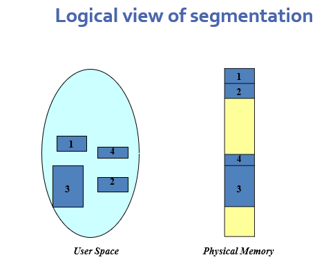

**Segmentation** is a memory management technique where **a program is divided into variable-sized segments**, based on its **logical parts** like:

- Code (instructions)
    
- Data
    
- Stack
    
- Heap
    
- Functions, arrays, etc.
    

Each segment is treated as a **separate unit** with its own **starting address and length**.

---
### Why use segmentation?

- **Closer to programmer’s view**: Programs are written in logical parts (functions, variables), and segmentation follows this structure.
    
- **Protection**: Each segment can have different access rights.
    
- **Sharing**: Code segments can be shared between processes.
    
- **Modularity**: Easier to manage and compile modules independently

---
### Logical View of Segmentation

---
## More From Slides
### Logical Address in Segmentation

A **logical address** in segmentation is represented as a **two-tuple**:

> ⟨**segment number**, **offset**⟩

This means:

- The CPU generates the segment number `s` and an offset `d` within that segment.
    
- This address needs to be translated into a physical address.
    

---

### Segment Table

The **segment table** maps the two-part logical address to a **physical address**.

Each **entry in the segment table** has:

- **Base**: The starting **physical address** of the segment in memory.
    
- **Limit**: The **length** of the segment (how far the offset can go).
    

---

### Address Translation in Segmentation

1. The CPU uses the **segment number** to index into the **segment table**.
    
2. It checks if the **offset < limit**.
    
    - If **valid**, the physical address = base + offset.
        
    - If **invalid**, a **segmentation fault** (trap) occurs.
        

---

### Segment Table Registers

- **STBR (Segment Table Base Register):**  
    Holds the **physical memory address** where the segment table starts.  
    (It acts like a pointer to the segment table.)
    
- **STLR (Segment Table Length Register):**  
    Holds the **number of segments** used by the program.  
    The segment number `s` is valid only if `s < STLR`.
    

---

### Example

If:

- Segment table entry for segment 2:
    
    - Base = 1000
        
    - Limit = 500
        
- Logical address: ⟨2, 100⟩
    

Then:

- Since 100 < 500 → Valid
    
- Physical address = 1000 + 100 = **1100**
    

---

### Summary:

> Segmentation uses ⟨segment number, offset⟩ to access memory. The segment table provides the base and limit for each segment. If the offset is valid, the physical address is calculated; else, an error occurs. STBR and STLR help manage this table in memory.