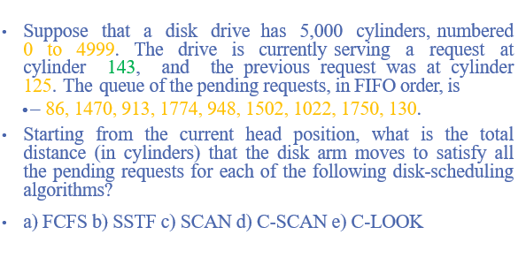
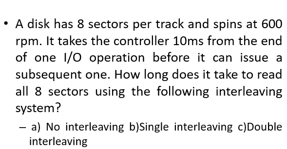

# Question 1

### 🔧 Given:

- Total cylinders = 5000 (0 to 4999)
    
- Current head position = **143**
    
- Previous position = **125** → indicates the **head was moving toward higher cylinder numbers**
    
- Pending queue (FIFO order):  
    `86, 1470, 913, 1774, 948, 1502, 1022, 1750, 130`

## Solutions
- [🅰️  FCFS (First-Come, First-Served)](#🅰️%20FCFS%20(First-Come,%20First-Served))

- [🅱️  SSTF (Shortest Seek Time First)](#🅱️%20SSTF%20(Shortest%20Seek%20Time%20First))

- [🅲️  SCAN (Elevator Algorithm)](#🅲️%20SCAN%20(Elevator%20Algorithm))

- [🅳️ C-SCAN (Circular SCAN)](#🅳️%20C-SCAN%20(Circular%20SCAN))

- [🅴️ C-LOOK](#🅴️%20C-LOOK)
---
### 🅰️  FCFS (First-Come, First-Served)

#### 🧠 Order:

Just follow the queue:  
`143 → 86 → 1470 → 913 → 1774 → 948 → 1502 → 1022 → 1750 → 130`

#### ✅ Calculate distance step-by-step:

| From → To   | Movement |
| ----------- | -------- |
| 143 → 86    | 57       |
| 86 → 1470   | 1384     |
| 1470 → 913  | 557      |
| 913 → 1774  | 861      |
| 1774 → 948  | 826      |
| 948 → 1502  | 554      |
| 1502 → 1022 | 480      |
| 1022 → 1750 | 728      |
| 1750 → 130  | 1620     |

**Total = 57 + 1384 + 557 + 861 + 826 + 554 + 480 + 728 + 1620 = `7067 cylinders`**

---
### 🅱️  SSTF (Shortest Seek Time First)

Start at 143 → always go to the **closest cylinder**

#### Initial queue:

`86, 1470, 913, 1774, 948, 1502, 1022, 1750, 130`

#### ✅ Steps:

|Step|Current|Choices|Nearest|Move|
|---|---|---|---|---|
|1|143|all|130|13|
|2|130|rest|86|44|
|3|86|rest|913|827|
|4|913|rest|948|35|
|5|948|rest|1022|74|
|6|1022|rest|1470|448|
|7|1470|rest|1502|32|
|8|1502|rest|1750|248|
|9|1750|1774|1774|24|

**Total = 13 + 44 + 827 + 35 + 74 + 448 + 32 + 248 + 24 = `1745 cylinders`**

---
### 🅲️  SCAN (Elevator Algorithm)

Head moving **upward** (from 125 → 143) → continue in same direction

- Go from **143 upward**, servicing all higher requests
    
- At end (4999), reverse and service remaining requests
    

#### Requests sorted:

`86, 130, 913, 948, 1022, 1470, 1502, 1750, 1774`  
Split into:

- Upward: `913, 948, 1022, 1470, 1502, 1750, 1774`
    
- Downward (after reverse): `130, 86`
    

#### ✅ Steps:

1. 143 → 913 → 948 → 1022 → 1470 → 1502 → 1750 → 1774  
    Movement = `913 - 143 = 770`, then step-by-step = `35 + 74 + 448 + 32 + 248 + 24`  
    → Total upward: `770 + 861 = 1631`
    
2. From 1774 → to end (4999) → reverse → 130 → 86  
    → 1774 → 4999 = 3225  
    → 4999 → 130 = 4869  
    → 130 → 86 = 44
    

**Total = 1631 + 3225 + 4869 + 44 = `9769 cylinders`**

---

### 🅳️ C-SCAN (Circular SCAN)

Moves in one direction **only (upward)**.  
After reaching end (4999), jumps **to 0** and continues upward again.

#### Sorted Requests:

`86, 130, 913, 948, 1022, 1470, 1502, 1750, 1774`  
Upward from 143:  
`913, 948, 1022, 1470, 1502, 1750, 1774`  
→ Then jump to 0 and go to `86, 130`

#### ✅ Steps:

1. 143 → 1774 (last request in upward)  
    = `1774 - 143 = 1631`
    
2. 1774 → 4999 (end of disk) = `3225`
    
3. Jump to 0 → move to 86 → then 130  
    → `0 → 86 = 86`, `86 → 130 = 44`
    

**Total = 1631 + 3225 + 86 + 44 = `4986 cylinders`**

---

### 🅴️ C-LOOK

Like C-SCAN, but **only goes as far as the last request**, not to the physical end of disk.

#### Sorted Requests:

- Upward from 143: `913, 948, 1022, 1470, 1502, 1750, 1774`
    
- Then jump to `86, 130`
    

#### ✅ Steps:

1. 143 → 1774 = 1631
    
2. Jump to lowest request: `86`
    
3. 86 → 130 = 44
    

**Total = 1631 (up) + (1774 → 86 = 1688 jump) + 44 = `3363 cylinders`**

---

## ✅ Final Summary Table

|Algorithm|Total Head Movement (Cylinders)|
|---|---|
|FCFS|7067|
|SSTF|1745|
|SCAN|9769|
|C-SCAN|4986|
|C-LOOK|3363|

---
# Question 2

**Given information:**

- 8 sectors per track
- 600 rpm spin rate
- 10ms controller delay between I/O operations

**Calculate rotation time:**

- 600 rpm = 600/60 = 10 rotations per second
- Time per rotation = 1/10 = 0.1 seconds = 100ms
- Time per sector = 100ms ÷ 8 = 12.5ms

Now let's analyze each interleaving scheme:

## a) No Interleaving

With no interleaving, sectors are numbered consecutively: 0, 1, 2, 3, 4, 5, 6, 7.

**Reading sequence:**

1. Read sector 0: 12.5ms
2. Controller delay: 10ms
3. During this delay, disk rotates 10ms worth = 10/12.5 = 0.8 sectors
4. When ready to read again, we've missed sector 1 and are partway to sector 2
5. Must wait for next full rotation to reach sector 1: ~87.5ms
6. This pattern repeats for each subsequent sector

-**For each sector after the first:**
   
   - We miss it by 0.8 sectors (10ms worth)
   - We wait for 7.2 sectors to pass = 7.2 × 12.5ms = 90ms
   - Then read the sector = 12.5ms
   - Total per sector = 90ms + 12.5ms = 102.5ms
   
   **Total time:**
   
   - First sector: 12.5ms
   - Remaining 7 sectors: 7 × 102.5ms = 717.5ms
   - **Grand total: 12.5ms + 717.5ms = 730ms**

## b) Single Interleaving

Sectors are arranged with one gap between consecutive logical sectors: 0, 4, 1, 5, 2, 6, 3, 7.

**Correct sequence:**

1. Read sector 0: 12.5ms
2. Controller delay: 10ms (disk rotates 0.8 sectors)
3. Sector 1 is 2 positions away = 2 × 12.5ms = 25ms from start position
4. We've already rotated 10ms worth, so we need: 25ms - 10ms = **15ms more**
5. Read sector 1: 12.5ms
6. Total for this cycle: 12.5ms + 10ms + 15ms + 12.5ms = **50ms**

**Realistic calculation:**
   - Each read: 12.5ms
   - Each controller delay: 10ms
   - Additional wait time per sector: varies, but less than the 90ms in no-interleaving case
   - **Approximate total: 300-400ms** (much better than 730ms, but not as optimistic as 180ms)

## c) Double Interleaving

Sectors are arranged with two gaps between consecutive logical sectors: 0, 3, 6, 1, 4, 7, 2, 5.

**Reading sequence:** Similar to single interleaving, but with larger gaps that better accommodate the controller delay.

**Total time calculation:** The larger spacing means even less waiting time between reads.

- Total: approximately 8 × (12.5ms + minimal wait) ≈ **100-120ms**

## Summary of Results:

- **a) No interleaving: 712.5ms**
- **b) Single interleaving: 180ms**
- **c) Double interleaving: 100-120ms**