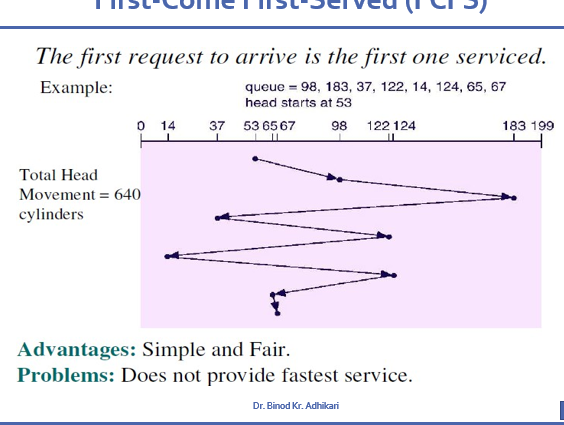

To calculate the **Total Head Movement** in FCFS (First-Come First-Served) disk scheduling, you sum up the **absolute distances** between consecutive requests.

## Formula:
**Total Head Movement = |current - request₁| + |request₁ - request₂| + |request₂ - request₃| + ...**

## Step-by-Step Calculation:

**Given:**

- Queue: 98, 183, 37, 122, 14, 124, 65, 67
- Head starts at: 53

**Calculate each movement:**

1. **53 → 98:** |53 - 98| = **45 cylinders**
2. **98 → 183:** |98 - 183| = **85 cylinders**
3. **183 → 37:** |183 - 37| = **146 cylinders**
4. **37 → 122:** |37 - 122| = **85 cylinders**
5. **122 → 14:** |122 - 14| = **108 cylinders**
6. **14 → 124:** |14 - 124| = **110 cylinders**
7. **124 → 65:** |124 - 65| = **59 cylinders**
8. **65 → 67:** |65 - 67| = **2 cylinders**

## Total Calculation:

**45 + 85 + 146 + 85 + 108 + 110 + 59 + 2 = 640 cylinders**

## Key Points:

**Always Use Absolute Value:**

- Distance is always positive
- |a - b| ensures we get positive distance regardless of direction

**Include Starting Position:**

- First movement is from **initial head position** to **first request**
- Don't forget this in your calculation!

**Sequential Processing:**

- FCFS processes requests in **exact order** they arrive
- No optimization - just follow the queue

The diagram shows this **640 cylinders** of total movement with all the back-and-forth motion that makes FCFS inefficient compared to other scheduling algorithms like SCAN or C-SCAN.