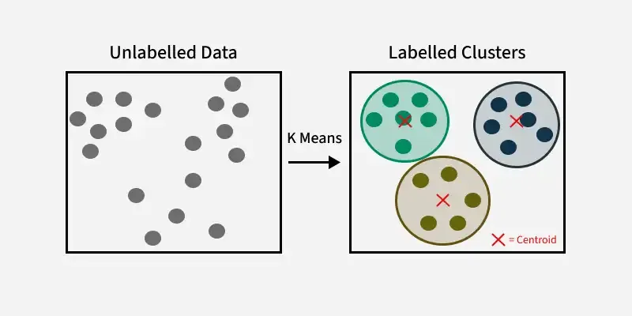

- **K-means clustering** is an **unsupervised machine learning algorithm** used to group data points into a predefined number of clusters (groups), called **K**. 
- It's one of the most commonly used clustering techniques.

### Working
1. **Choose the number of clusters (K)**.
2. **Randomly initialize K centroids** (cluster centers).
3. **Assign each data point** to the nearest centroid (based on Euclidean distance).
4. **Recalculate the centroids** by computing the mean of all data points in each cluster.
5. **Repeat steps 3 and 4** until the centroids no longer change (or changes are very small).
###### Figure of Clustering

---
### [Numerical of K-means](Numerical%20of%20K-means.md)
---

## Tag
#k-means #clustering #unsupervised-learning

## Ref
[K-means-Geeks](https://www.geeksforgeeks.org/k-means-clustering-introduction/)