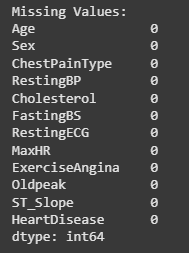

 - Similar for both iris and housing
### Firstly Mounting the CSV from the drive
```python
# a) Check the dataset for missing values and handle, if any.

# Getting the CSV file from the drive
from google.colab import drive
drive.mount('/content/drive')

# # Verify the mount was successful
# !ls '/content/drive/My Drive'

```

---
### Checking for null values and removing it
```python
# Importing libraries
import pandas as pd
import numpy as np
# For Encoding
from sklearn.preprocessing import LabelEncoder

# Update this path to match where your file is in your Drive
file_path = '/content/drive/My Drive/Colab Notebooks/Yujan_NN/NN_Lab3/heart.csv'

# Read the CSV
df = pd.read_csv(file_path)

# Display the first few rows
# print(df.head())

# Check for missing values
print("\nMissing Values:")
print(df.isnull().sum())

# Drop rows with any missing values
df = df.dropna()

# # Checking to confirm the dropping of missing values
# # Check for missing values
# print("\nMissing Values:")
# print(df.isnull().sum())
```

##### Slight Explanation
 - `df.isnull()` creates a table with `True` where the value is missing and `False` where it’s not.
    
- `.sum()` counts how many missing values there are in each column.
###### Output

