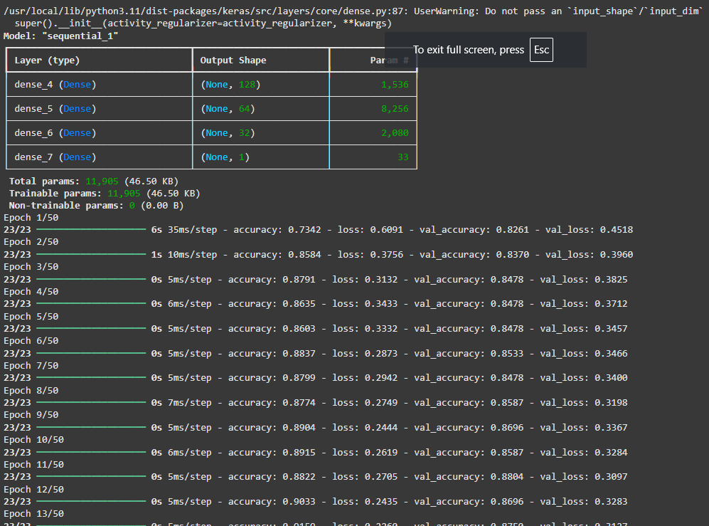

```python

# d) Construct an MLP with configuration 11x128x64x32x1. Use Adam optimizer and appropriate activation functions and train the model.

from sklearn.model_selection import train_test_split
from sklearn.preprocessing import StandardScaler
from tensorflow.keras.models import Sequential
from tensorflow.keras.layers import Dense
from tensorflow.keras.optimizers import Adam

# Split data into features (X) and target (y)
X = df_encoded.drop(columns=['HeartDisease'])
y = df_encoded['HeartDisease']

# Split into training and testing sets (80% train, 20% test)
X_train, X_test, y_train, y_test = train_test_split(X, y, test_size=0.2, random_state=42)


# Scale the features
# Scaling is done after to avoid overfitting?
scaler = StandardScaler()
X_train_scaled = scaler.fit_transform(X_train)
X_test_scaled = scaler.transform(X_test)


# Build the MLP model
model = Sequential()

## Add layers to the MLP
# Input layer + 1st hidden layer with 128 neurons and ReLU
model.add(Dense(128, activation='relu', input_shape=(X_train_scaled.shape[1],)))

# 2nd hidden layer with 64 neurons
model.add(Dense(64, activation='relu'))

# 3rd hidden layer with 32 neurons
model.add(Dense(32, activation='relu'))

# Output layer with 1 neuron and sigmoid activation (binary output: 0 or 1)
model.add(Dense(1, activation='sigmoid'))

##  Compile the model
model.compile(
    optimizer=Adam(),                    # Optimizer: Adam
    loss='binary_crossentropy',         # Loss function: for binary classification
    metrics=['accuracy']                # Evaluation metric
)

## Show model summary
model.summary()

## Train the model
history = model.fit(
    X_train_scaled, y_train,
    validation_data=(X_test_scaled, y_test),
    epochs=50,
    batch_size=32,
    verbose=1
)


```

###### Output
