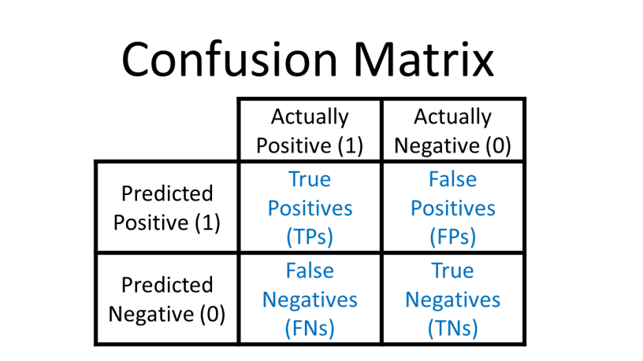

## Code
```python
import matplotlib.pyplot as plt
import seaborn as sns
from sklearn.metrics import confusion_matrix, classification_report, accuracy_score, precision_score, recall_score, f1_score

# Predict probabilities on the test data
y_pred_prob = model.predict(X_test_scaled)

# Convert probabilities to class labels (0 or 1) and flatten to 1D array
y_pred = (y_pred_prob > 0.5).astype(int).flatten()

# Display Confusion Matrix
cm = confusion_matrix(y_test, y_pred)

# Plotting the Confusion Matrix
plt.figure(figsize=(6, 5))
sns.heatmap(cm, annot=True, fmt='d', cmap='Blues', cbar=False, xticklabels=['Pred: 0', 'Pred: 1'], yticklabels=['True: 0', 'True: 1'])
plt.title('Confusion Matrix')
plt.xlabel('Predicted')
plt.ylabel('Actual')
plt.show()

# Calculate and display individual evaluation metrics
accuracy = accuracy_score(y_test, y_pred)
precision = precision_score(y_test, y_pred)
recall = recall_score(y_test, y_pred)
f1 = f1_score(y_test, y_pred)

print(f"\nAccuracy:  {accuracy:.4f}")
print(f"Precision: {precision:.4f}")
print(f"Recall:    {recall:.4f}")
print(f"F1 Score:  {f1:.4f}")

# Detailed classification report
print("\nClassification Report:")
print(classification_report(y_test, y_pred))

```

##### Output


---
---
## Explanation
`matplotlib.pyplot`- Used to create plots (like the confusion matrix)
`seaborn`- Makes matplotlib plots visually appealing
`sklearn.metrics`-provides a functions to evaluate model performance

#### Predicting Probabilities
**`y_pred_prob= model.predict(X_test_scaled)`**
-> **`model.predict()`** : Predicts probabilities (e.g., `[0.7, 0.3]`) for each test sample.
-> **`y_pred_prob`**: Contains probabilities (between 0 and 1) for class `1` (e.g., `[0.7, 0.2, 0.9]`).

==Further Explanation==
- The first number is the probability that the sample belongs to Class 0.
- The second number is the probability that the sample belongs to Class 1.
- Always Adds up to 1.

#### Convert Probabilities to Class labels (0 or 1)
`y_pred = (y_pred_prob > 0.5).astype(int).flatten()`
-> if greater then 0.5 then 1 else 0
-> *astype(int)* : Converts True/False to 1/0
-> *flatten()* : Ensures the prediction are in 1D array (e.g. [1,0,1])

#### Confusion Matrix
 
- **TN (True Negative)**: Correctly predicted `0`.
- **FP (False Positive)**: Predicted `1` but actual `0`.
- **FN (False Negative)**: Predicted `0` but actual `1`.
- **TP (True Positive)**: Correctly predicted `1`.

```python
plt.figure(figsize=(6, 5))  # Set figure size
sns.heatmap(cm, annot=True, fmt='d', cmap='Blues', cbar=False, 
            xticklabels=['Pred: 0', 'Pred: 1'], 
            yticklabels=['True: 0', 'True: 1'])
plt.title('Confusion Matrix')
plt.xlabel('Predicted')
plt.ylabel('Actual')
plt.show()
```

- **`sns.heatmap()`**: Visualizes the confusion matrix with colors.
    - `annot=True`: Displays numbers in cells.
        
    - `fmt='d'`: Formats numbers as integers.
        
    - `cmap='Blues'`: Uses a blue color gradient.
        
- **Labels**:
    - `xticklabels`: Predicted classes (`0` or `1`).
        
    - `yticklabels`: Actual classes.

#### Calculate Evaluation Metrics
- **Accuracy**: % of correct predictions.
	    (TP + TN) / Total
	
- **Precision**: % of `1` predictions that were correct.
	    TP / (TP + FP)
	
- **Recall**: % of actual `1`s correctly predicted.
	    TP / (TP + FN)
- **F1-Score**: Balances precision and recall.
		$F_1 = 2 \times \frac{\text{Precision} \times \text{Recall}}{\text{Precision} + \text{Recall}}$

**NOTE**
- Precision vs. Recall:
    - High **precision**: Few false positives (good for spam detection).
        
    - High **recall**: Few false negatives (good for disease diagnosis).