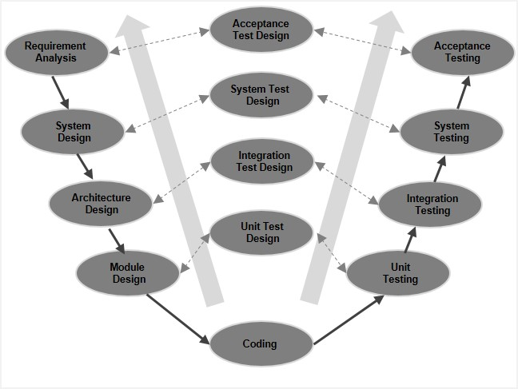

- Extension of Waterfall Model

- The **V-Model** (short for **Verification and Validation Model**) is an **extension of the Waterfall model**
	- where **testing activities** are **planned in parallel** with development stages.

- Called the **V-Model** because the process is shaped like the letter “V” 
	- the **left side is development**, the **right side is testing**, and the **bottom is coding**.